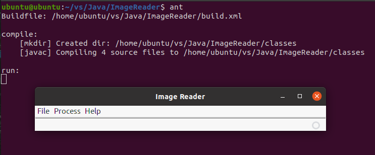
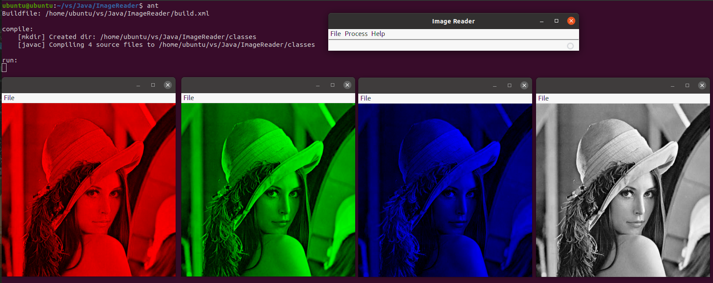
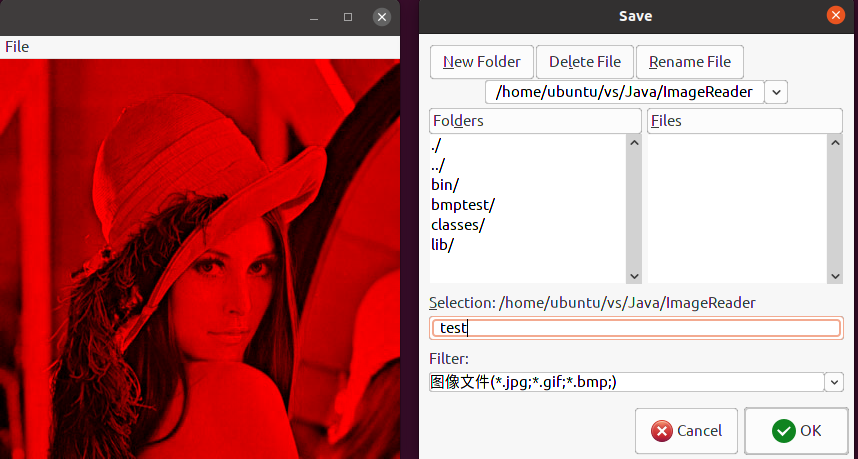
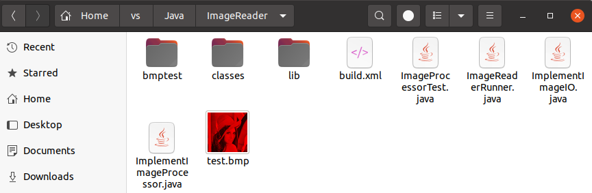
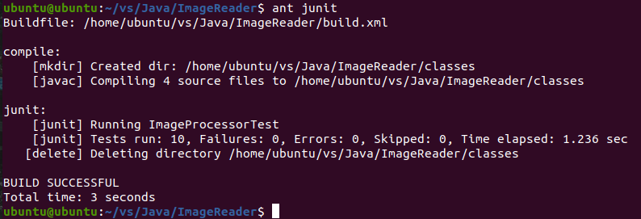
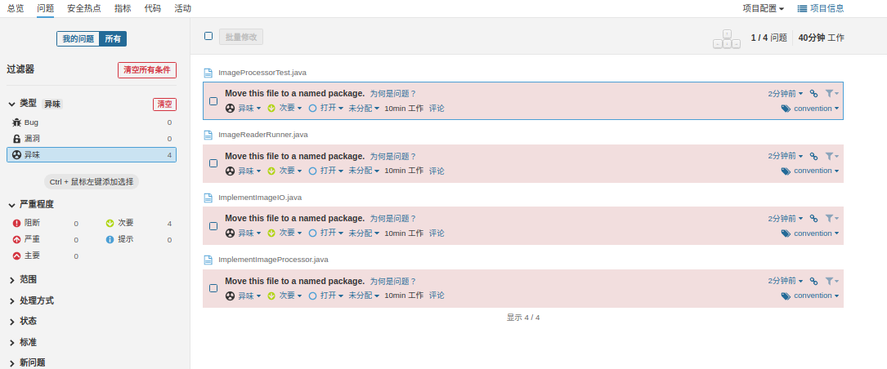
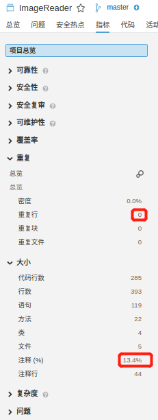

# ImageReader

## 文件夹结构

```
.
|-- ImageProcessorTest.java
|-- ImageReaderRunner.java
|-- ImplementImageIO.java
|-- ImplementImageProcessor.java
|-- lib
    |-- appframework-1.0.3.jar
    |-- ImageReader.jar
    |-- junit-4.10.jar
    |-- swing-worker-1.1.jar
|-- bmptest
    |-- 1.bmp
    |-- 2.bmp
    |-- goal
        |-- 1_blue_goal.bmp
        |-- 1_gray_goal.bmp
        |-- 1_green_goal.bmp
        |-- 1_red_goal.bmp
        |-- 2_blue_goal.bmp
        |-- 2_gray_goal.bmp
        |-- 2_green_goal.bmp
        |-- 2_red_goal.bmp
|-- build.xml
|-- sonar-project.properties
|-- Image
|-- README.md
```

## 项目运行

### ImageReaderRunner文件

在`build.xml`文件目录下，终端输入命令：

    ant

运行程序，截图如下：



点击File->Open，打开bmptest文件夹目录下的`1.bmp`文件，然后再点击Process，分别点击Show Red Component、Show Green Component、Show Blue Component、Show Gray Color，可以看到，生成不同颜色图像：



随便点击一个图片框左上角的File，然后点击Save，选择目录保存，可以看到，图片被保存到了指定目录：





### 使用junit进行测试

在`build.xml`文件目录下，终端输入命令：

    ant junit

程序进行junit测试，截图如下：



可以看到，所有测试全部通过

### Sonar测试

如果要使用Sonar进行分析，首先在终端输入`cd %SONAR_HOME%`进入SonarQube的`bin`文件夹目录下，然后输入`./sonar.sh start`启动Sonar服务，等到在浏览器输入网址 http://localhost:9000/ ，看到SonarQube的服务页面后，进入`ImageReader`项目文件夹，输入`sonar-scanner`，即可进行分析。登录进去之后，点击`ImageReader`项目，可以看到分析结果如下：



项目没有严重或阻断问题，只有几个异味，且来源都是因为没有把文件放在包里所引起的，这些异味可以忽略，符合代码分析要求。



项目的重复行为0，注释率为13.4%，大于10%，符合要求。
