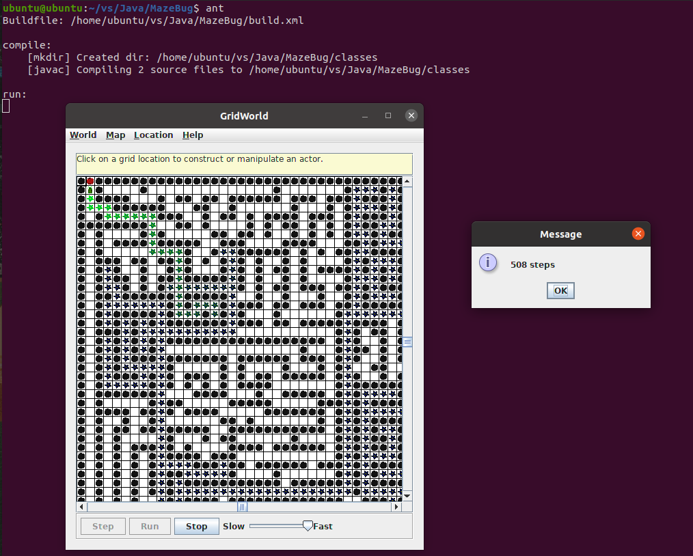

# Part2

## 文件夹结构

```
.
|-- MazeBug.java
|-- MazeBugRunner.java
|-- test
    |-- EasyMaze.txt
    |-- FinalMaze01.txt
    |-- FinalMaze02.txt
    |-- FinalMaze03.txt
    |-- FinalMaze04.txt
    |-- FinalMaze05.txt
    |-- OneRoadMaze.txt
|-- lib
    |-- gridworld.jar
|-- build.xml
|-- sonar-project.properties
|-- Image
|-- README.md
```

## 项目运行

### 模式选择

在`MazeBug.java`文件的构造函数中，如果把成员变量`chooseMode`置为`randomMode`(0)，那么当遇到可以移动的位置在两个或两个以上需要选择位置时，会按照随机方式选择移动位置，如果把成员变量`chooseMode`置为`predictMode`(1)，那么会按照方向的概率估计来控制选择某个方向的概率，再随机选择移动方向。

### MazeBugRunner文件

在`build.xml`文件目录下，终端输入命令：

    ant

运行程序，截图如下：


点击Map->Load Map，打开test文件夹目录下的`EasyMaze.txt`文件，然后再点击Run开始运行，可以看到，小虫找到终点，输出步数：


点击World->Set grid...->UnboundedGrid，再点击Map->Load Map，使用`FinalMaze01.txt`文件进行测试：



可以看到，步数为508。

使用`FinalMaze02.txt`文件进行测试：


可以看到，步数为415。

使用`FinalMaze03.txt`文件进行测试：


可以看到，步数为396。

使用`FinalMaze04.txt`文件进行测试：


可以看到，步数为337。

使用`FinalMaze05.txt`文件进行测试：


可以看到，步数为508。

### Sonar测试

如果要使用Sonar进行分析，首先在终端输入`cd %SONAR_HOME%`进入SonarQube的`bin`文件夹目录下，然后输入`./sonar.sh start`启动Sonar服务，等到在浏览器输入网址 http://localhost:9000/ ，看到SonarQube的服务页面后，进入`MazeBug`项目文件夹，输入`sonar-scanner`，即可进行分析。登录进去之后，点击`MazeBug`项目，可以看到分析结果如下：


项目没有严重或阻断问题，没有异味，符合代码分析要求。


项目的重复行为0，注释率为17.9%，大于10%，符合要求。
