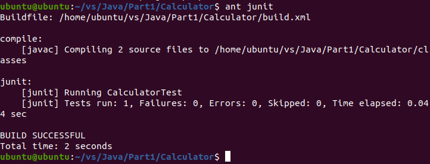

# 阶段一：项目启动

## 文件夹结构

```
.
|-- HelloWorld
    |-- build.xml
    |-- src
        |-- HelloWorld.java
        |-- HelloWorldTest.java
    |-- lib
        |-- junit-4.10.jar
    |-- classes
        |-- HelloWorld.class
        |-- HelloWorldTest.class
    |-- sonar-project.properties
|-- Calculator
    |-- build.xml
    |-- src
        |-- Calculator.java
    |-- classes
        |-- Calculator.class
    |-- sonar-project.properties
|-- Image
|-- README.md
```

## 环境配置

在网上下载好相应配置所需文件并放到相应文件夹中后，输入`sudo vim /etc/profile`在`/etc/profile`文件夹中设置环境变量，配置如下：


然后查看配置情况：


junit的版本为4.10，直接放在项目的`lib`文件夹中

## 项目运行

### HelloWorld项目

`HelloWorld`文件夹中，已经配置好了构建文件`build.xml`，在终端中输入`ant init`是初始化项目文件夹，因为已经在`src`文件夹中写好代码，所以不用输入`ant init`，否则代码文件会被清空，直接输入`ant`项目即可运行，输出如下：


如果需要运行junit测试，只需输入`ant junit`即可测试，输出如下：


如果要使用Sonar进行分析，首先在终端输入`cd %SONAR_HOME%`进入SonarQube的`bin`文件夹目录下，然后输入`./sonar.sh start`启动Sonar服务，等到在浏览器输入网址 http://localhost:9000/ ，看到SonarQube的服务页面后，进入`HelloWorld`项目文件夹，输入`sonar-scanner`，即可进行分析：


登录进去之后，点击`HelloWorld`项目，可以看到分析结果如下：


项目只有两个异味，是因为没有把文件放在包里所引起的，由于这只是两个功能十分简单小文件，不必一定把这两个文件放进某个包里，所以这个异味可以忽略。

### Calculator项目

在`Calculator`文件夹目录，输入`ant`直接运行，可以看到：


计算器也成功显示。如果数字输入框中为空，点击OK时会在结果框弹出提示`Number Missing`，如果数字输入框中输入的字符不为数字点击OK时，会在结果框弹出提示`Not Number`，如果符号框中还没有选择符号就点击OK时会在结果框弹出提示`Symbol Missing`，计算器的样式与要求给定的基本一致。

如果需要运行junit测试，只需输入`ant junit`即可测试，输出如下：



同样，如果要使用Sonar进行分析，启动Sonar服务后，在项目文件夹下，输入`sonar-scanner`，即可进行分析：


可以看到，和HelloWorld项目的问题一样，可以忽略掉。

### 运行BugRunner

将GridWorldCode下载下来并解压，进入GridWorldCode文件夹目录，输入

```
javac -classpath .:gridworld.jar ./projects/firstProject/BugRunner.java
```

进行编译，然后输入

```
java -classpath .:gridworld.jar:./projects/firstProject BugRunner
```

运行BugRunner，效果截图如下：


也可以进入到firstProject文件夹中，输入

```
javac -classpath .:./../../gridworld.jar BugRunner.java
```

进行编译，然后输入

```
java -classpath .:./../../gridworld.jar BugRunner
```

运行BugRunner，效果截图如下：


