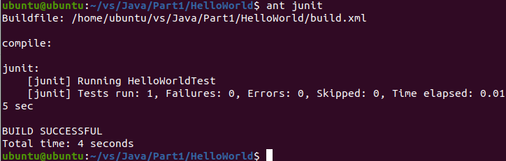
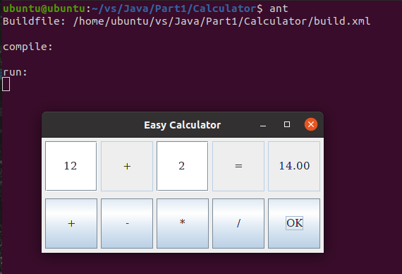
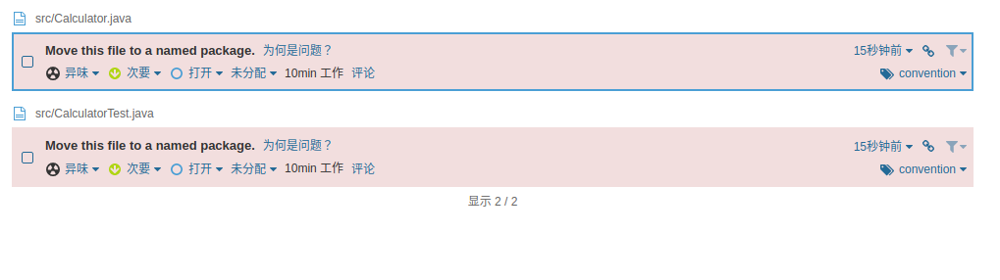
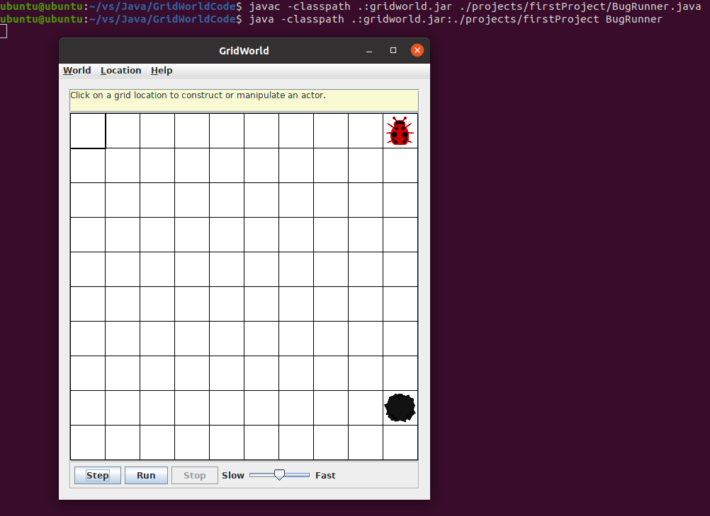

# Vi,Java,Ant和Junit的自学报告

## Vi部分

### 1、基本介绍

vi 编辑器是 Linux/UNIX 环境下经典的编辑器。Linux vi 命令非常强大，熟练地使用它可以高效的编辑代码，配置系统文件等。vi 编辑器只是一个文本编辑程序，它没有菜单，只有命令，且命令繁多。现在的 UNIX/Linux 大都使用 vim 代替了 vi。vim 是 vi 的增强版，与 vi 编辑器完全兼容，而且实现了很多增强功能。

### 2、vi三种工作模式

vi 编辑器有 3 种基本工作模式，分别是命令模式、文本输入模式和末行模式。

（1）、命令行模式：该模式是进入 vi 编辑器后的默认模式。任何时候，不管用户处于何种模式，按下`Esc`键即可进入命令模式。此时从键盘上输入的任何字符都被当做编辑命令来解释。所输入的命令并不回显在屏幕上。若输入的字符不是 vi 的合法命令，vi 会响铃报警。

（2）、文本输入模式

在命令模式下输入插入命令`i`、附加命令`a`、打开命令`o`、修改命令`c`、取代命令`r`或替换命令`s`都可以进入文本输入模式。用户输入的任何字符都被 vi 当做文件内容保存起来，并将其显示在屏幕上。在文本输入过程中，若想回到命令模式下，按下`Esc`键即可。

（3）、末行模式：

在命令模式下，用户按:键即可进入末行模式下，此时 vi 会在显示窗口的最后一行（通常也是屏幕的最后一行）显示一个:作为末行模式的说明符，等待用户输入命令。多数文件管理命令都是在此模式下执行的。末行命令执行完后，vi 自动回到命令模式。

### 3、进入vi编辑器

在终端输入命令，即可进入vi编辑器，常见命令有：

`vi filename`：编辑或建立文件名为`filename`的文件
`vi`：直接进入vi，这时编辑的文件是没有文件名的，所以在退出 vi 时，需要在退出命令后输入文件名，这样才能保存
`vi + 行号 filename`：进入 vi 后，光标处于文件中特定的某行上
`vi + filename`：进入 vi 之后光标处于文件最末行
`vi + /模式字符串 filename`：进入 vi 后，光标就处于文件中第一个与指定模式串相匹配的那行上
`vi 需要打开文件的通配符`：可同时来编辑多个文件，打开与通配符匹配的所有文件。

### 4、修改文件命令

`i`：将文本插入到光标所在位置前
`I`：将文本插入当前行的行首
`a`：将新文本追加到光标当前所在位置之后
`A`：将新文本追加到所在行的行尾
`o`：在光标所在行的下面插入一个空行，并将光标置于该行的行首
`O`：在光标所在行的上面插入一个空行，并将光标置于该行的行首

### 5、文本删除命令

`x`：删除光标处的字符。若在 x 之前加上一个数字 n，则删除从光标所在位置开始向右的 n 个字符。
`X`：删除光标前面的字符。若在 X 之前加上一个数字 n，则删除从光标前面那个字符开始向左的 n 个字符。
`dd`命令：该命令删除光标所在的整行。在 dd 前可加上一个数字 n，表示删除当前行及其后 n-1 行的内容。
`D/d$`：两个命令功能一样，都是删除从光标所在处开始到行尾的内容。
`d0`：该命令删除从光标前一个字符开始到行首的内容。
`dw`：该命令删除一个单词。若光标处在某个词的中间，则从光标所在位置开始删至词尾。同 dd 命令一样，可在 dw 之前加一个数字n，表示删除 n 个指定的单词。
`d(`：该命令删除到上一句开始的所有字符。
`d)`：该命令删除到下一句开始的所有字符。
`d}`：该命令删除到上一段开始的所有字符。
`d{`：该命令删除到下一段开始的所有字符。
`d<CR>`：该命令（\<CR>表示回车）删除包括当前行在内的两行字符。

### 6、文本复制命令

`yy`：复制光标所在的整行。在 yy 前可加一个数字 n，表示复制当前行及其后 n-1 行的内容。
`Y/y$`：两命令功能一样，都是复制从光标所在处开始到行尾的内容。
`y0`：复制从光标前一个字符开始到行首的内容。
`y(`：复制到上一句的开始。
`y)`：复制到下一句幵始的所有字符。
`y{`：复制到上一段的开始。
`y}`：复制到下一段开始的所有字符。
`y<CR>`（\<CR> 表示回车）：复制包括当前行在内的两行内容。
`yw`：复制一个单词。若光标处在某个词的中间，则从光标所在位置开始复制至词尾。同 yy 命令一样，可在 yw 之前加一个数字 n，表示复制 n 个指定的单词。
`p`：粘贴命令，粘贴当前缓冲区中的内容。
`v`：在命令模式下进行文本选择。在需要选择的文本的起始处按下 v 键进入块选择模式，然后移动光标到块尾处。这之间的部分被高亮显示，表示被选中。
`V`：在命令模式下按行进行文本选择。在需要选择的文本的第一行按下 V 键，然后移动光标到块的最后一行。这之间的所有行被高亮显示，表示被选中。

### 7、撤销命令

`u`：该命令撤销上一次所做的操作。多次使用 u 命令会一步一步依次撤销之前做过的操作（在一次切换到文本输入模式中输入的所有文本算一次操作）。
`U`：该命令会一次性撤销自上次移动到当前行以来做过的所有操作，再使用一次 U 命令则撤销之前的 U 命令所做的操作，恢复被撤销的内容。

### 8、重复命令

`.`：在命令模式下，按下`.`键，就可以再执行一次前面刚完成的某个复杂的命令。

### 9、退出命令

在末行模式下，输入：

`q`：如果退出时当前编辑文件尚未保存，则 vi 并不退出，而是继续等待用户的命令。
`q!`：该命令不论文件是否改变都会强行退出 vi 编辑器。
`w  新文件名`：vi 保存当前编辑文件，但并不退出，而是继续等待用户输入命令。在使用 w 命令时，可以再给当前编辑文件起一个新的文件名。
`w!  新文件名`：该命令与`:w`命令相同，所不同的是，即使指定的新文件存在，vi 编辑器也会用当前编辑文件对其进行替换，而不再询问用户。
`wq`：vi 将先保存文件，然后退出 vi 返回到 shell。如果当前文件尚未取名，则需要现指定一个文件名。
`x`：若当前编辑文件曾被修改过，则 vi 会保存该文件。否则 vi 直接退出，不保存该文件。

### 10、字符替换命令

`r`：该命令将当前光标所指的字符替换为提供的字符。可以在该命令之前加上数字 n，表示将从当前字符开始的 n 个字符替换为提供的字符。
`R`：让 vi 进入 replace 模式。在此模式下，每个输入的字符都会替换当前光标下的字符，直到输入`Esc`结束该模式。

### 11、光标移动命令

`h`：光标左移一个字符
`j`：光标下移一行
`k`：光标上移一行
`l`：光标右移一个字符
`H`：光标移至当前屏幕的第 1 行，而不是整个文件的第 1 行。若在 H 命令之前加 上数字 n，则将光标移至第 n 行的行首。
`M`：将光标移至屏幕显示文件的中间行的行首。即如果当前屏幕已经充满，则移动到整个屏幕的中间行；否则，移动到显示文本的那些行的中间行。
`L`：将光标移至屏幕显示文件的最底行的行首。即如果文件内容需要超过一个屏幕显示时，该命令将光标移至屏幕上最底行的行首；否则该命令将光标移至文件最后一行的行首。若在 L 命令之前加上数字 n，则将光标移至从屏幕底部算起第 n 行的行首。
`G`：在全文的范围内移动光标，此时的光标移动范围不再受屏幕的限制。
`w`：将光标右移至下一个字的字首，字是指英文单词、标点符号和非字母字符。
`W`：将光标右移至下一个字的字首，字是指两个空格之间的任何内容
`e`：如果光标起始位置处于字内，则将把光标移到本字字尾；如果光标起始位置处于字尾，则将把光标移动到下一个字的字尾，所指的字是指英文单词、标点符号和非字母字符。
`E`：如果光标起始位置处于字内，则将把光标移到本字字尾；如果光标起始位置处于字尾，则将把光标移动到下一个字的字尾，所指的字是指两个空格之间的任何内容。
`b`：如果光标处于所在字内，则将把光标移至本字字首；如果光标处于所在字字首，则将把光标移到上一个字的字首。所指的字是指英文单词、标点符号和非字母字符。
`B`：如果光标处于所在字内，则将把光标移至本字字首；如果光标处于所在字字首，则将把光标移到上一个字的字首。所指的字是指两个空格之间的任何内容。
`{`：将光标向前移至上一个段落的开头，段落是指以一个空白行开始和结束的片段。
`}`：将光标向后移至下一个段落的开头。

### 12、vi文本移动命令

`>`：将指定的正文行向右移动，通常是右移 8 个空格。移动正文行的范围由光标所在行和随后输入的光标移动命令所限定。使用格式为`>n`，n 表示光标所在位置后面的文本行数。也可以不写 n，此时默认为 1。如果只想移动光标所在的文本行，可以写`>0`。
`<`：将指定的正文行向左移动。其使用方式与命令`>`相同，但是方向相反。
`>>`：将光标所在行右移 8 个空格。如果在>>命令之前给出一个数字 n，则表示光标当前行及其下面的 n-1 行（共n行）都右移 8 个空格。
`<<`：将光标所在行左移 8 个空格。其使用与`>>`命令相同，但是移动方向相反

### 13、文本跨行移动

`m`：实现文本的跨行移动，使用方式为`imj`，表示把第 i 行移至第 j 行的下方。

### 14、屏幕滚动命令

`Ctrl+u`：将屏幕向前（文件头方向）翻滚半屏。
`Ctrl+d`：将屏幕向后（文件尾方向）翻滚半屏。
`Ctrl+f`：将屏幕向文件尾方向翻滚一整屏。
`Ctrl+b`：将屏幕向文件首方向翻滚一整屏。

可以在滚屏和分页命令之前加上一个数字 n，表示屏幕向前或向后翻滚 n 行，或者屏幕向前或向后移动 n 页，

### 15、字符串检索命令

`/`：格式为`/string`，表示从光标处开始向后寻找字符串`string`。
`?`：格式为`?string`，表示从光标处开始向前寻找字符串`string`。
`n`：重复上一条检索命令。
`N`：重复上一条检索命令，但检索方向改变。
`g/`：格式为`g/string`，表示使光标停止在第一个检索到的`string`串的行首。

### 16、字符串替换命令

在末行模式下使用替换命令，格式为：

`[range]s/s1/s2/ [option]`

+ `[range]`表示检索范围，省略时表示当前行。
  + `1,10`表示从第 1 行到 10 行。
  + `%`表示整个文件，同`1, $`。
  + `. ,$`从当前行到文件尾。
+ `s` 为替换命令。
+ `s1`为要被替换的串，`s2`为替换的串。
+ `option`表示选项：
  + `/g`表示在全局文件中进行替换。
  + `/c`表示在每次替换之前需要用户进行确认。
  + 省略时仅对每行第一个匹配串进行替换。

### 17、窗口切分命令

在末行模式中，输入`split`命令即可实现窗口的切分，格式为：

`: split文件名`

split 也可简写为 sp。这时窗口切分为上下两部分，下半部分对应原来的文件，上半部分对应新打开的文件。

有时用户需要在多窗口之间进行切换，常见命令有：

`Ctrl+w，然后 j`：移动光标到下面的一个窗口。
`Ctrl+w，然后 k`：移动光标到上面的一个窗口。
`Ctrl+w，然后 q`：关闭当前窗口。
`Ctrl+w，然后 w`：移动光标到另一个窗口。

### 18、属性设置命令

在末行模式下设置属性，输入：

`:set nu (nonu)`：显示行号（或者不显示行号）。
`:set hlsearch (nohlsearch)`：设定搜寻字符串反白显示（或者不反白显示）。
`:set autoindent`：显示程序语法自动缩进。
`:set backup(nobackup)`：自动储存备份文件（或者不自动备份文件）。
`:set all`：显示所有的选项。
`:syntax on (off)`：实现程序语法高亮显示（或者不高亮显示）。
`:set ignorecase(noignorecase)`：忽略大小写（或者区分大小写）。

## Java部分

### 1、环境配置

+ 首先需要下载java开发工具包JDK，下载地址：http://www.oracle.com/technetwork/java/javase/downloads/index.html 或 http://jdk.java.net/archive/ ，解压得到文件夹`jdk-11`，放到目录`XXX\jdk-11`下
+ 然后配置环境变量：
  + Windows下，新建系统环境变量JAVA_HOME，值为`XXX\jdk-11`，然后在系统变量PATH中加上`%JAVA_HOME%\bin;`
  + Linux下，将解压出来的文件夹命名为`jdk-11`，然后进入`/usr`目录后，新建`Java`目录，然后进入`Java`目录，将`jdk-11`移动到该目录下，接着在终端输入命令`sudo vim /etc/profile`，打开`/etc/profile`文件，然后将语句：
    ```
    #set java environment
    export JAVA_HOME=/usr/Java/jdk-11
    export JRE_HOME=${JAVA_HOME}
    export CLASSPATH=.:${JAVA_HOME}/lib:${JRE_HOME}/lib
    export PATH=${JAVA_HOME}/bin:$PATH
    ```
    添加到文件末尾，再输入`source /etc/profile`或重新启动系统使配置生效。或直接输入语句`sudo apt-get install default-jdk`，也可以实现安装。
+ 最后在命令行或终端输入`java -version`，如果弹出版本号等详细信息，说明安装成功。

### 2、基本使用

Java的语法和C++差不多，除了没有指针、内存可以自动管理等许多高级功能的区别之外，基本语法差别并不大，学过C++的人学Java很快就可以上手。比如编译运行`HelloWorld.java`文件，首先输入`vim HelloWorld.java`创建文件，然后将以下代码添加到`HelloWorld.java`文件中：

```java
public class HelloWorld {
    public static void main(String[] args) {
      System.out.println("Hello World!");
    }
}
```

然后输入`:wq`保存并且进入终端，在终端文件目录下输入`javac HelloWorld.java`进行编译，再输入`java HelloWorld`即可运行文件，输出结果：

```
Hello World!
```

这里主要记录这次实训所用到的`JAVA SWING`部分的学习。

（1）、SWING 基本介绍

Swing API 是一组可扩展的 GUI 组件，用来创建基于 JAVA 的前端/ GUI 应用程序。

（2）、控件

每个 SWING 控件从下列组件类的等级继承属性：

+ Component：Component 是 SWING 的非菜单用户界面控件的一个抽象基类。组件代表一个用图形表示的对象
+ Container：Container 是一个组件，它可以包含其他 SWING 组件。
+ JComponent：JComponent 是一个所有 swing UI 组件的基类。为了使用继承自 JComponent 的一个 swing 组件，组件必须是一个包容层次结构，它的根是一个顶层的 Swing 容器。

使用 SWING 来设计 GUI 时常用的控件列表：

+ JLabel：JLabel 对象是一个在容器中放置文本的组件。
+ JButton：该类创建一个有标签的的按钮。
+ JColorChooser：JColorChooser 提供一个控制面板，设计允许用户操作和选择颜色。
+ JCheck Box：JCheckBox 是一个图形化的组件，它的状态要么是 on（true）要么是 off（false）。
+ JRadioButton：JRadioButton 类是一个图形化的组件，在一个组中，它的状态要么是 on（true）要么是off（false）。
+ JList：JList 组件呈现给用户一个滚动的文本项列表。
+ JComboBox：JComboBox 组件呈现给用户一个显示菜单的选择。
+ JTextField：JTextField 对象是一个文本组件，它允许编辑单行文本。
+ JPasswordField：JPasswordField 对象是一个专门用于密码输入的文本组件。
+ JTextArea：JTextArea 对象是一个文本组件，它允许编辑多行文本。
+ ImageIcon：ImageIcon 控件是一个图标界面的实现，它从图像描绘图标
+ JScrollbar：JScrollbar 控件代表一个滚动条组件，为了让用户从值的范围中选择。
+ JOptionPane：JOptionPane 提供了一组提示用户输入值的标准对话框，或者通知他们其他东西。
+ JFileChooser：JFileChooser 控件代表一个对话框窗口，用户可以从该对话框窗口选择一个文件。
+ JProgressBar：随着任务完成的进展，进度条显示任务完成的百分比。
+ JSlider：JSlider 让用户在有界区间内通过滑动旋钮图形化地选择一个值。
+ JSpinner：JSpinner 是一个单行输入字段，它让用户从一个有序序列中选择一个数字或者一个对象值。

（3）、事件类：

+ AWTEvent：它是所有 SWING 事件的根事件类。这个类和它的子类取代了最初的 java.awt.Event 类。
+ ActionEvent：当单击按钮或双点击列表的项时，生成 ActionEvent。
+ InputEvent：InputEvent 类是所有组件层输入事件的根事件类。
+ KeyEvent：在按下一个字符时，按键事件生成。
+ MouseEvent：这个事件表明一个鼠标动作发生在一个组件中。
+ WindowEvent：这个类的对象代表一个窗口状态的变化。
+ AdjustmentEvent：这个类的对象代表由可调整的对象发出的调整事件。
+ ComponentEvent：这个类的对象代表一个窗口状态的变化。
+ ContainerEvent：这个类的对象代表一个窗口状态的变化。
+ MouseMotionEvent：这个类的对象代表一个窗口状态的变化。
+ PaintEvent：这个类的对象代表一个窗口状态的变化。

（4）、事件监听器接口：

+ ActionListener：用于接收动作事件。
+ ComponentListener：用于接收组件事件。
+ ItemListener：用于接收项目事件。
+ KeyListener：用于接收按键事件。
+ MouseListener：用于接收鼠标事件。
+ WindowListener：用于接收窗口事件。
+ AdjustmentListener：用于接收调整事件。
+ ContainerListener：用于接收容器事件。
+ MouseMotionListener：用于接收鼠标移动事件。
+ FocusListener：用于接收焦点事件。

（5）、容器：

+ Panel：JPanel 是一个最简单的容器。它提供了任何其他组件可以被放置的空间，包括其他面板。
+ Frame：JFrame 是一个带有标题和边界的顶层窗口。
+ Window：JWindow 对象是一个没有边界和菜单条的顶层窗口。

## Ant部分

### 1、Ant基本介绍

Ant是Java的生成工具，类似于Unix中的Make工具，用来自动化编译、生成Java项目，内置了javac、java、创建目录、复制文件等功能，是一个跨平台工具。

### 2、Ant配置

+ 在Ant安装之前需要安装好JDK，设置环境变量JAVA_HOME；
+ 然后在 https://ant.apache.org/bindownload.cgi 下载Ant，解压得到文件夹`apache-ant-1.10.11`，放在目录：`XXX\apache-ant-1.10.11`下
+ 接着配置环境变量：
  + 在Windows下，新建一个新的环境变量`ANT_HOME`，值为`XXX\apache-ant-1.10.11`，然后在系统变量PATH中加上`%ANT_HOME%\bin;`，就完成配置。
  + 在Linux下，将解压后得到的文件夹命名为`apache-ant-1.10.11`，然后
  进入`/usr`目录后，新建`Java`目录，然后进入`Java`目录，将`apache-ant-1.10.11`移动到该目录下，接着在终端输入命令`sudo vim /etc/profile`，打开`/etc/profile`文件，然后将语句：
    ```
    #set ant environment
    export ANT_HOME=/usr/Java/apache-ant-1.10.11
    export PATH=$PATH:${ANT_HOME}/bin
    ```
    添加到文件末尾，再输入`source /etc/profile`或重新启动系统使配置生效。或直接在终端输入`sudo apt-get install ant`，进行安装。
+ 最后在命令行或终端输入`ant`，如果出现`Buildfile: build.xml does not exist! Build failed`，说明配置成功。

### 3、建立buildfile

ant的默认生成文件为`build.xml`；
输入ant后，ant会在当前目录下搜索是否有build.xml，如果有，则执行；当然也可以自定义生成文件，通过ant -f a.xml即可指定a.xml为生成文件；

生成文件`build.xml`一般放在项目顶层目录中，一个项目层次结构是：
  + src文件夹存放源文件。
  + classes文件夹存放编译后的文件。
  + lib文件夹存放第三方JAR包。

例如：

```
HelloWorld项目文件夹
  |-- build.xml
  |-- src
        |-- HelloWorld.java
        |-- HelloWorldTest.java
  |-- lib
        |-- junit-4.10.jar
  |-- classes
        |-- HelloWorld.class
        |-- HelloWorldTest.class
  |-- sonar-project.properties
```

#### 生成文件`build.xml`的元素

+ `<project>`：工程的标签，一个buildfile里面只有一个，一般形式为：`<project name="projectname" default="" basedir=".">`
  + name是工程名字
  + default是输入`ant`时默认运行的target
  + basefir是指定基准目录
  + description是项目的描述
+ `<property>`：project的子元素，使用在`<project>`和`<project/>`之间，用于定义属性，设置常用的路径/文件包，一般形式为`<property name="pname" value="pvalue"/>`，使用时只需`${pname}`
+ `<target>`：project的子元素，使用在`<project>`和`<project/>`之间，是要运行的功能/任务，一般形式为：`<target name="" depends="" if ="" unless=""></target>`
  + name是任务名称
  + depends是依赖项，在当前target执行前要先执行的target。一次ant里只执行一次，可以有多个名称，用逗号分割
  + if的值表示一个属性名，只有设置了该属性名，才能执行此target
  + unless的值表示一个属性名，只有没有设置该属性名，才能执行此target
  + description是target的描述信息
+ Task是target的子元素，一个target中可以有多个task，常见的task有：
  + `<javac>`：用来编译java文件，和命令行的javac相同，一般形式为：`<javac srcdir="" destdir="" classpath="" includeantruntime="true"/>`
    + srcdir是源文件目录
    + destdir是生成文件目录
    + classpath是要编译时依赖的第三方jar包或者其他文件，可以用相对路径
    + includeantruntime是显示ant运行时间，一般设置为true即可
  + `<java>`：java的运行命令，一般形式为：
    ```
    <java classname="" fork="yes">
      <arg line="param1 param2 param3"/>
    </java>
    ```
    + classname指定要运行的类名称
    + fork表示是否另外新建一个JVM来运行程序，而不是中断ANT命令
  + `<classpath>`：和`<javac>`的classname属性一样
    + path是要用到的类所在的目录
  + `<junit>`：junit单元测试
    + printsummary	是否输出测试概要
  + `<path>`：设置常用的路径/文件包，可用`<pathelement>`来设置多个，在`<junit>`标签里的`<classpath>`下使用为依赖包。
    + id是索引值
    + refid是表示该path引用索引为id的path
  + `<jar>`：打包成jar包，一般形式为：
    ```
    <jar destfile="main.jar" basedir="">
      <manifest>
          <attribute name="Main-Class" value="classname"/>
      </manifest>
    </jar>
    ```
    + destfiie的值为jar包的名称，一般为${dest}/main.jar；
    + basedir的值是需要打成jar包的目录，一般为${classes}；
    + manifest表示设置META-INF；
  + `<mkdir>`：创建目录，可以连续创建，一般形式为：`<mkdir dir="a\b"/>`
  + `<delete>`：删除目录或文件，一般形式为：`<delete dir=""/>`、`<delete file=""/>`
  + `<path>`：表示一个类路径。各个路径之间用分号或者冒号隔开。这些字符在运行时被替代为执行系统的路径分隔符。类路径被设置为项目中 jar 文件和类文件的列表，一般形式为：
    ```
      <path id="classpath">  
        <pathelement path="lib;src"/>  
        <pathelement location="lib"/> 
        <dirset dir="lib">  
          <include name="**/*Test*"/>  
          <exclude name="**/class"/>  
        </dirset>  
        <filelist dir="lib" files="a.xml,b.xml"/>  
        <fileset dir="lib">  
          <include name="**/*.jar"/>  
        </fileset>  
      </path> 
    ```
    + id表示编号，用来被引用
      + pathelement的path表示多个目录，location表示一个目录
      + dirset的dir属性指定根目录
        + include表示包含的目录
        + exclude表示不包含的目录
      + filelist的dir指定根路径，files指定文件名的列表
      + flieset的dir属性指定根路径
        + include指定包含的文件名
  + `<junit>`：进行junit测试，一般形式为：
    ```
      <junit haltonfailure="true" printsummary="true">
          <test name="com.tutorialspoint.UtilsTest"/>
      </junit>
    ```
    + haltonfailure表示当有故障发生的时候，停止执行过程。
    + printsummary表示告知 Ant 展示每个测试例子的简单统计。
    + test的name是执行的类

#### 4、使用Ant自动编译HelloWorld

构建文件`build.xml`：

```xml
<?xml version="1.0" encoding="UTF-8"?>
<!-- 项目名字是HelloWorld，默认运行的target是run -->
<project name="HelloWorld" default="run" basedir=".">
  <!-- 设置项目常用的src、classes、lib路径 -->
  <property name="src_dir" location="src" />
  <property name="classes_dir" location="classes"/>
  <property name="lib_dir" location="lib" />
  <!--设置junit-4.10.jar的路径-->
  <path id="junitpath">
    <pathelement location="${lib_dir}/junit-4.10.jar" />
  </path>
  <!-- 初始化项目目录结构 -->
  <target name="init">
    <delete dir="${src_dir}"/>
    <delete dir="${classes_dir}"/>
    <delete dir="${lib_dir}"/>
    <mkdir dir="${src_dir}"/>
    <mkdir dir="${classes_dir}"/>
    <mkdir dir="${lib_dir}"/>
  </target>
  <!-- 编译任务，使用junit-4.10.jar完成对src文件夹中java源文件的编译，并将生成文件输出到classes文件夹中 -->
  <target name="compile">
    <javac srcdir="${src_dir}" destdir="${classes_dir}" classpath="junitpath" includeantruntime="true"/>
  </target>
  <!-- 运行任务，将classes文件夹中的文件运行起来 -->
  <target name="run" depends="compile">
    <java classname="HelloWorld" fork="yes">
        <classpath path="${classes_dir}"/>
    </java>
  </target>
  <!--清理项目的classes文件夹-->
  <target name="clean">
    <delete dir="${classes_dir}" />
    <mkdir dir="${classes_dir}"/>
  </target>
  <!-- 测试HelloWorld.java文件 -->
  <target name="junit" depends="compile">
    <junit haltonfailure="true" printsummary="true">
      <classpath path="${classes_dir}">
        <path refid="junitpath" />
      </classpath>
      <test name="HelloWorldTest" />
    </junit>
  </target>
</project>
```

在HelloWorld项目文件夹下放置`build.xml`，然后在终端进入文件夹目录，输入`ant init`初始化项目文件夹目录，然后在src文件夹下输入`vim HelloWorld.java`创建文件，然后将以下代码添加到`HelloWorld.java`文件中：

```java
public class HelloWorld {
    private static String text = "Hello World!";

    public static String getText() {
      return text;
    }
    public static void main(String[] args) {
      System.out.println(text);
    }
}
```

然后输入`:wq`保存并且进入终端，进入`build.xml`所在文件目录下，输入`ant`，运行大致如下：

```
compile:

run:
     [java] Hello World!

BUILD SUCCESSFUL
Total time: 1 second
```

可以看到，输出了`Hello World!`，配置成功。

## Junit部分

### 1、Junit基本介绍

JUnit 是一个 Java 编程语言的单元测试框架。JUnit 在测试驱动的开发方面有很重要的发展，是起源于 JUnit 的一个统称为 xUnit 的单元测试框架之一。JUnit 促进了“先测试后编码”的理念，强调建立测试数据的一段代码，可以先测试，然后再应用。增加了产量和程序的稳定性，可以减少压力和花费在排错上的时间。

### 2、Junit配置

+ 在Junit安装之前需要安装好JDK，设置环境变量JAVA_HOME；
+ 然后在 https://sourceforge.net/projects/junit/ 下载Junit，得到文件`junit-4.10.jar`，放在目录：`XXX\junit-4.10.jar`下
+ 接着配置环境变量：
  + 在Windows下，新建一个新的环境变量`JUNIT_HOME`，值为之前目录`XXX`，然后在系统变量CLASSPATH中加上`%CLASSPATH%;%JUNIT_HOME%\junit-4.10.jar;.;`，就完成配置。
  + 在Linux下，将`junit-4.10.jar`移动到`/usr/Java`目录下，接着在终端输入命令`sudo vim /etc/profile`，打开`/etc/profile`文件，然后将语句：
    ```
    #set junit environment
    export JUNIT_HOME=/usr/Java
    export CLASSPATH=$CLASSPATH:$JUNIT_HOME/junit-4.10.jar:.
    ```
    添加到文件末尾，再输入`source /etc/profile`或重新启动系统使配置生效。

### 3、Junit基本使用

#### 一些注意事项：

+ 测试方法必须使用@Test
+ 测试方法必须使用 public void 进行公开，不能带参数
+ 一般使用单元测试会新建一个测试目录举办目录测试，在生产应用的时候简单代码测试下代码删除
+ 测试代码的包应该和被测试代码包结构保持一致
+ 测试单元中的每个方法都必须可以独立测试，方法间不能有任何依赖
+ 测试类使用测试类名的一般后缀
+ 测试方法使一般使用测试成为方法名

#### 测试失败说明：

失败：是由于测试结果和预期结果引发的，表明测试的这个点发现了问题
错误：是由代码异常引起的，它可以产生于测试代码制作的错误，也可以是被测试代码中隐藏的错误

#### 一些常用注解：

`@Test`: 将一个普通方法测试成一个测试方法 @Test(excepted=xx.class): xx.class 表示异常类，表示测试的方法抛出此异常时，认为是正常的通过@Test(timeout = ms数) : 测试方法执行时间是否符合预期
`@BeforeClass`：会在所有的执行前被执行，静态（方法一个方法执行一次，而且是第一个运行）
`@AfterClass`：会在所有的执行之后进行执行，静态方法（最后一次执行的方法，而且是一次运行）
`@Before`：会在每一个测试方法被运行前执行一次
`@After`：会在每一个测试方法运行后被执行一次
`@Ignore`：所运行的测试方法会被测试器忽略
`@RunWith`：可以更改测试运行器 org.junit.runner.Runner
参数：参数化注解

### 4、JUnit 中重要的 API

JUnit 中的最重要的程序包是 ​junit.framework​ 它包含了所有的核心类。重要的类有：

|名称|功能|
|---|---|
|Assert|assert ​方法的集合|
|TestCase|一个定义了运行多重测试的固定装置|
|TestResult|​TestResult ​集合了执行测试样例的所有结果|
|TestSuite|​TestSuite ​是测试的集合|

Assert类的重要方法有：

|名称|功能|
|---|---|
|`void assertEquals​(boolean expected, boolean actual)`​|检查两个变量或者等式是否平衡|
|​`void assertFalse​(boolean condition)​`|检查条件是假的|
|`​​void assertNotNull​(Object object)`​|检查对象不是空的|
|​​`void assertNull​(Object object)`​|检查对象是空的|
|​​`void assertTrue​(boolean condition)`​|检查条件为真|
|​​`void fail​()`|​在没有报告的情况下使测试不通过|

TestCase​类的重要方法有：

|名称|功能|
|---|---|
|`int countTestCases()​`|为被run(TestResult result) 执行的测试案例计数|
|`​TestResult createResult()​​​`|创建一个默认的 TestResult 对象|
|`​String getName()​​`|获取 TestCase 的名称|
|`​TestResult run()​​`|一个运行这个测试的方便的方法，收集由TestResult 对象产生的结果|
|`​void run(TestResult result)​​`|在 TestResult 中运行测试案例并收集结果|
|`​void setName(String name)​​`|设置 TestCase 的名称|
|`​void setUp()​​`|创建固定装置，例如，打开一个网络连接|
|`​void tearDown()​​`|拆除固定装置，例如，关闭一个网络连接|
|`​String toString()​​`|返回测试案例的一个字符串表示|

TestResult​类的重要方法有：

|名称|功能|
|---|---|
|`void addError​​(Test test, Throwable t)​​`|在错误列表中加入一个错误|
|`​​void addFailure​(Test test, AssertionFailedError t)​`|在失败列表中加入一个失败|
|`​​void endTest​(Test test)`|​显示测试被编译的这个结果|
|`​int errorCount()​`|获取被检测出错误的数量|
|`​Enumeration errors()`|​返回错误的详细信息|
|`​int failureCount()`|​获取被检测出的失败的数量|
|`​void run(TestCase test​)`|运行 TestCase|
|`​int runCount()​`|获得运行测试的数量|
|`​void startTest(Test test)​`|声明一个测试即将开始|
|`void stop()​`|标明测试必须停止|

TestSuite​类的重要方法有：

|名称|功能|
|---|---|
|`void addTest(Test test)`| ​在套中加入测试。|
|`void addTestSuite(Class<? extends TestCase> testClass)`|​将已经给定的类中的测试加到套中。|
|​`int countTestCases()`​|对这个测试即将运行的测试案例进行计数。|
|`​String getName()`|​返回套的名称。|
|​`void run(TestResult result)​`|在 TestResult 中运行测试并收集结果。|
|`​void setName(String name)`|​设置套的名称。|
|`​Test testAt(int index)`​|在给定的目录中返回测试。|
|​`int testCount()`​|返回套中测试的数量。|
|`​static Test warning(String message)`​|返回会失败的测试并且记录警告信息。|

使用断言：

|名称|功能|
|---|---|
|`void assertEquals(boolean expected, boolean actual)`|检查两个变量或者等式是否平衡|
|`void assertTrue(boolean condition)`|检查条件为真|
|`void assertFalse(boolean condition)`|检查条件为假|
|`void assertNotNull(Object object)`|检查对象不为空|
|`void assertNull(Object object)`|检查对象为空|
|`void assertSame(Object expected, Object actual)`|assertSame() 方法检查两个相关对象是否指向同一个对象|
|`void assertNotSame(Object expected, Object actual)`|assertNotSame() 方法检查两个相关对象是否不指向同一个对象|
|`void assertArrayEquals(expectedArray, resultArray)`|assertArrayEquals() 方法检查两个数组是否相等|

### 5、利用Ant、Junit测试通过HelloWorld

构建文件`build.xml`：

```xml
<?xml version="1.0" encoding="UTF-8"?>
<!-- 项目名字是HelloWorld，默认运行的target是run -->
<project name="HelloWorld" default="run" basedir=".">
  <!-- 设置项目常用的src、classes、lib路径 -->
  <property name="src_dir" location="src" />
  <property name="classes_dir" location="classes"/>
  <property name="lib_dir" location="lib" />
  <!--设置junit-4.10.jar的路径-->
  <path id="junitpath">
    <pathelement location="${lib_dir}/junit-4.10.jar" />
  </path>
  <!-- 初始化项目目录结构 -->
  <target name="init">
    <delete dir="${src_dir}"/>
    <delete dir="${classes_dir}"/>
    <delete dir="${lib_dir}"/>
    <mkdir dir="${src_dir}"/>
    <mkdir dir="${classes_dir}"/>
    <mkdir dir="${lib_dir}"/>
  </target>
  <!-- 编译任务，使用junit-4.10.jar完成对src文件夹中java源文件的编译，并将生成文件输出到classes文件夹中 -->
  <target name="compile">
    <javac srcdir="${src_dir}" destdir="${classes_dir}" classpath="junitpath" includeantruntime="true"/>
  </target>
  <!-- 运行任务，将classes文件夹中的文件运行起来 -->
  <target name="run" depends="compile">
    <java classname="HelloWorld" fork="yes">
        <classpath path="${classes_dir}"/>
    </java>
  </target>
  <!--清理项目的classes文件夹-->
  <target name="clean">
    <delete dir="${classes_dir}" />
    <mkdir dir="${classes_dir}"/>
  </target>
  <!-- 测试HelloWorld.java文件 -->
  <target name="junit" depends="compile">
    <junit haltonfailure="true" printsummary="true">
      <classpath path="${classes_dir}">
        <path refid="junitpath" />
      </classpath>
      <test name="HelloWorldTest" />
    </junit>
  </target>
</project>
```

在HelloWorld项目文件夹下放置`build_nojunit.xml`，然后在终端进入文件夹目录，输入`ant init`初始化项目文件夹目录，然后在src文件夹下输入`vim HelloWorld.java`创建文件，然后将以下代码添加到`HelloWorld.java`文件中：

```java
public class HelloWorld {
    private static String text = "Hello World!";

    public static String getText() {
      return text;
    }
    public static void main(String[] args) {
      System.out.println(text);
    }
}
```

然后输入`:wq`保存并且进入终端，输入`vim HelloWorldTest.java`创建文件，然后将以下代码添加到`HelloWorldTest.java`文件中：

```java
import static org.junit.Assert.*;
import org.junit.Test;

public class HelloWorldTest {
    @Test
    public void test() {
      assertEquals("Hello World!", HelloWorld.getText());
    }
}
```

然后输入`:wq`保存并且进入终端，进入`build.xml`所在文件目录下，输入`ant junit`，运行大致如下：

```java
compile:

junit:
    [junit] Running HelloWorldTest
    [junit] Tests run: 1, Failures: 0, Errors: 0, Skipped: 0, Time elapsed: 0.017 sec

BUILD SUCCESSFUL
Total time: 1 second
```

可以看到，打印测试信息，配置成功。

## 按照学习的内容完成阶段一：

### 文件夹结构

```
.
|-- HelloWorld
    |-- build.xml
    |-- src
        |-- HelloWorld.java
        |-- HelloWorldTest.java
    |-- lib
        |-- junit-4.10.jar
    |-- classes
        |-- HelloWorld.class
        |-- HelloWorldTest.class
    |-- sonar-project.properties
|-- Calculator
    |-- build.xml
    |-- src
        |-- Calculator.java
    |-- classes
        |-- Calculator.class
    |-- sonar-project.properties
|-- Image
|-- README.md
```

### 环境配置

在网上下载好相应配置所需文件并放到相应文件夹中后，输入`sudo vim /etc/profile`在`/etc/profile`文件夹中设置环境变量，配置如下：


然后查看配置情况：


junit的版本为4.10，直接放在项目的`lib`文件夹中

### 项目运行

#### HelloWorld项目

`HelloWorld`文件夹中，已经配置好了构建文件`build.xml`，在终端中输入`ant init`是初始化项目文件夹，因为已经在`src`文件夹中写好代码，所以不用输入`ant init`，否则代码文件会被清空，直接输入`ant`项目即可运行，输出如下：


如果需要运行junit测试，只需输入`ant junit`即可测试，输出如下：



如果要使用Sonar进行分析，首先在终端输入`cd %SONAR_HOME%`进入SonarQube的`bin`文件夹目录下，然后输入`./sonar.sh start`启动Sonar服务，等到在浏览器输入网址 http://localhost:9000/ ，看到SonarQube的服务页面后，进入`HelloWorld`项目文件夹，输入`sonar-scanner`，即可进行分析：


登录进去之后，点击`HelloWorld`项目，可以看到分析结果如下：


项目只有两个异味，是因为没有把文件放在包里所引起的，由于这只是两个功能十分简单小文件，不必一定把这两个文件放进某个包里，所以这个异味可以忽略。

#### Calculator项目

在`Calculator`文件夹目录，输入`ant`直接运行，可以看到：



计算器也成功显示。如果数字输入框中为空，点击OK时会在结果框弹出提示`Number Missing`，如果数字输入框中输入的字符不为数字点击OK时，会在结果框弹出提示`Not Number`，如果符号框中还没有选择符号就点击OK时会在结果框弹出提示`Symbol Missing`，计算器的样式与要求给定的基本一致。

如果需要运行junit测试，只需输入`ant junit`即可测试，输出如下：


同样，如果要使用Sonar进行分析，启动Sonar服务后，在项目文件夹下，输入`sonar-scanner`，即可进行分析：



可以看到，和HelloWorld项目的问题一样，可以忽略掉。

#### 运行BugRunner

将GridWorldCode下载下来并解压，进入GridWorldCode文件夹目录，输入

```
javac -classpath .:gridworld.jar ./projects/firstProject/BugRunner.java
```

进行编译，然后输入

```
java -classpath .:gridworld.jar:./projects/firstProject BugRunner
```

运行BugRunner，效果截图如下：



也可以进入到firstProject文件夹中，输入

```
javac -classpath .:./../../gridworld.jar BugRunner.java
```

进行编译，然后输入

```
java -classpath .:./../../gridworld.jar BugRunner
```

运行BugRunner，效果截图如下：


