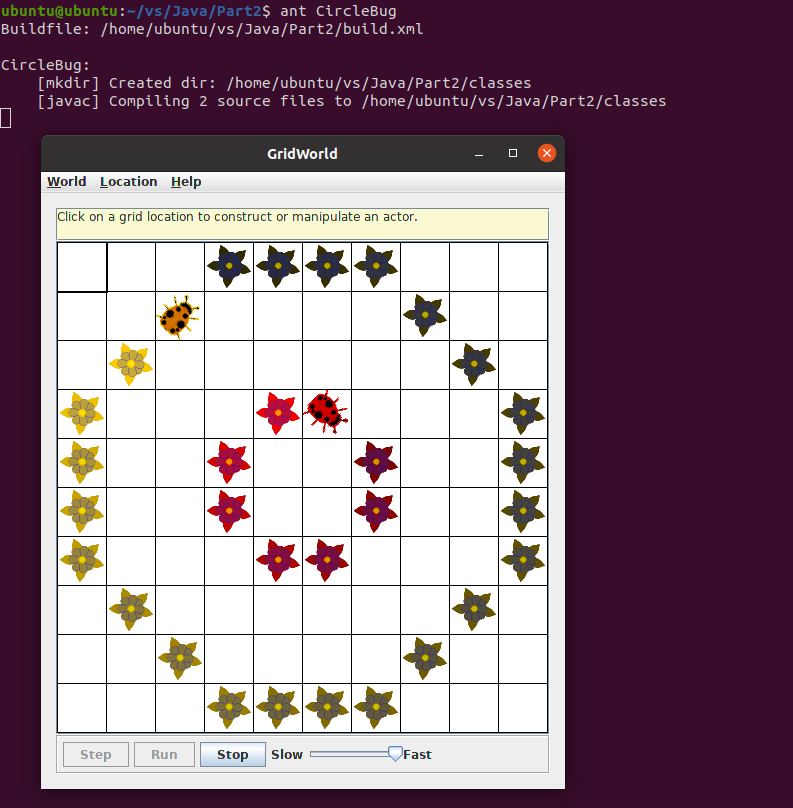
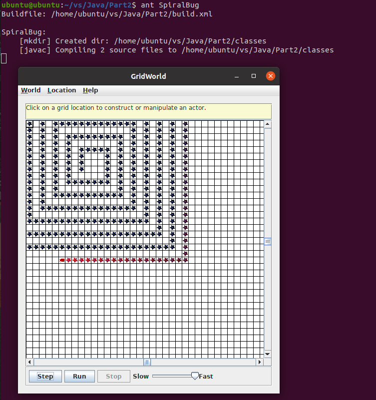
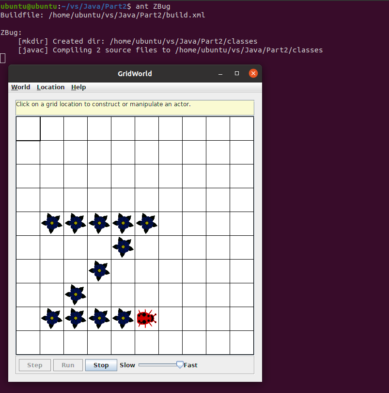
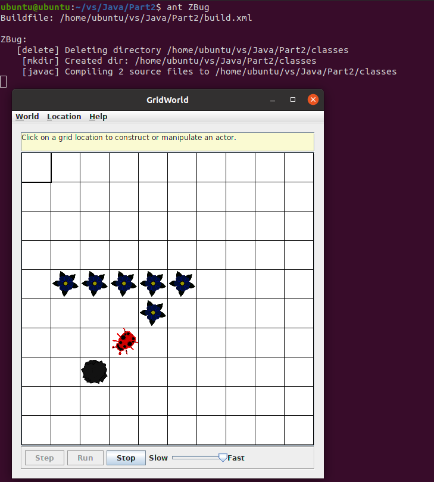
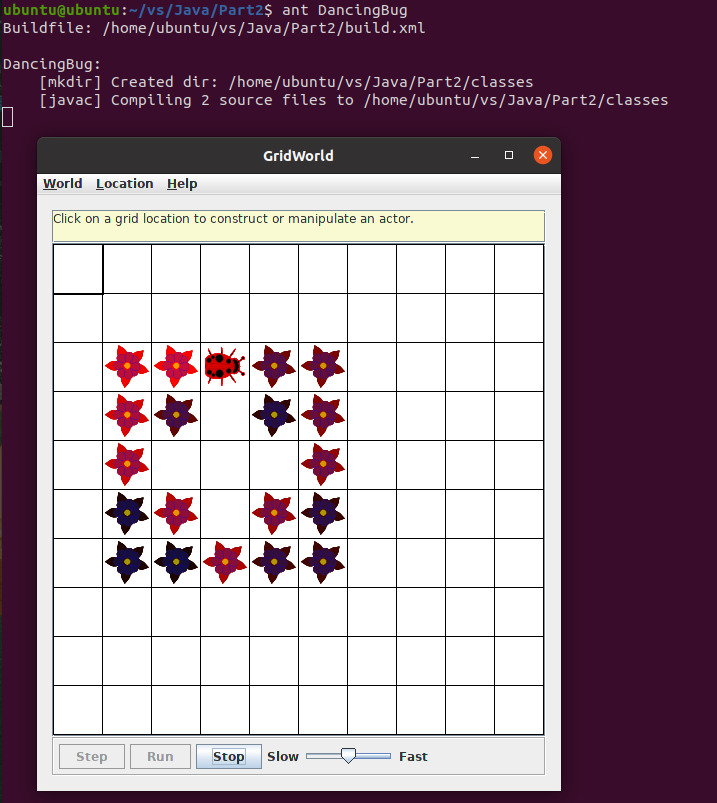
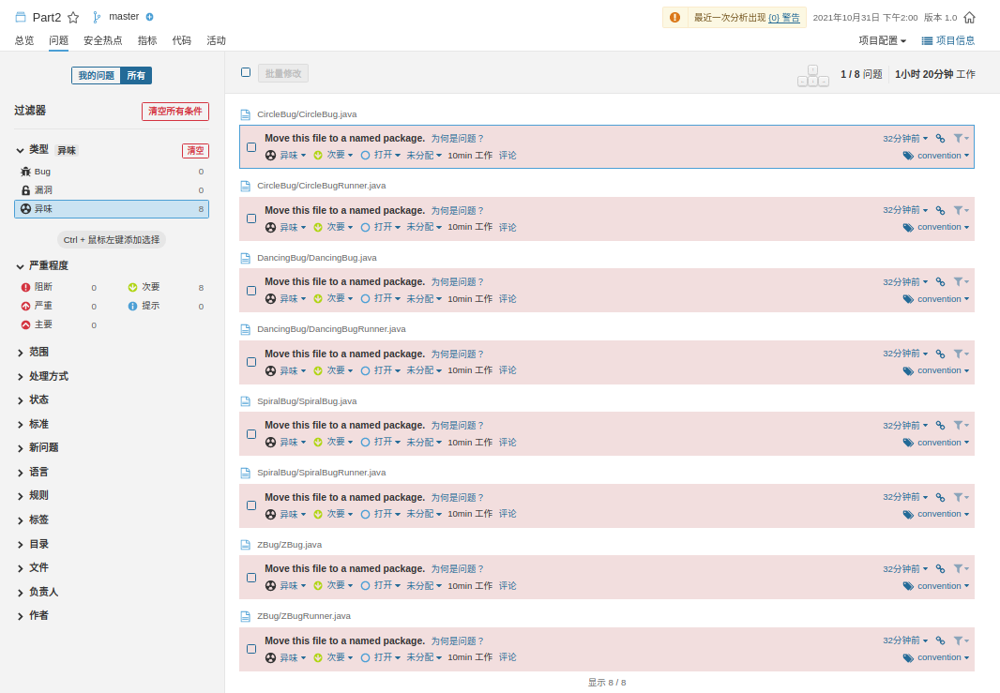
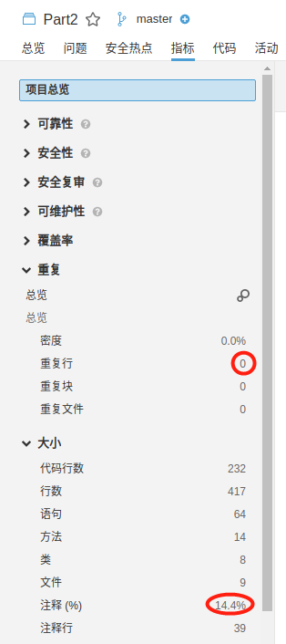

# Part2

## 文件夹结构

```
.
|-- CircleBug
    |-- CircleBug.java
    |-- CircleBugRunner.java
|-- DancingBug
    |-- DancingBug.java
    |-- DancingBugRunner.java
|-- SpiralBug
    |-- SpiralBug.java
    |-- SpiralBugRunner.java
|-- ZBug
    |-- ZBug.java
    |-- ZBugRunner.java
|-- lib
    |-- gridworld.jar
|-- build.xml
|-- sonar-project.properties
|-- Image
|-- README.md
```

## 项目运行

### CircleBug项目

在`build.xml`文件目录下，终端输入命令：

    ant CircleBug

运行程序，截图如下：



可以看到，因为在act方法中每次走完一个sideLength后turn方法被调用一次而不是两次。它的行为与BoxBug相比，每次走完一侧只向右转45°，虫子大概围绕一个圆形移动，实现了CircleBug。

### SpiralBug项目

在`build.xml`文件目录下，终端输入命令：

    ant SpiralBug

运行程序，截图如下：



可以看到，因为在act方法中每次走完一个sideLength后sideLength都会加一，所以虫子围绕螺旋图案移动，实现了SpiralBug。

### ZBug项目

在`build.xml`文件目录下，终端输入命令：

    ant ZBug

运行程序，截图如下：



可以看到，虫子从左上角开始围绕一个Z字形移动，完成一个Z字形图案后虫子会停下来，实现了ZBug。



如果虫子在中途遇到不可移动的物体而停下来之后，虫子也不会继续移动，也不会转向新的一侧。

### DancingBug项目

在`build.xml`文件目录下，终端输入命令：

    ant DancingBug

运行程序，截图如下：



可以看到，虫子按照一个跳跃数组{1, 2, 1, 2}，不断改变方向，完成跳舞图案，实现了DancingBug。

### Sonar测试

如果要使用Sonar进行分析，首先在终端输入`cd %SONAR_HOME%`进入SonarQube的`bin`文件夹目录下，然后输入`./sonar.sh start`启动Sonar服务，等到在浏览器输入网址 http://localhost:9000/ ，看到SonarQube的服务页面后，进入`Part2`项目文件夹，输入`sonar-scanner`，即可进行分析。登录进去之后，点击`Part2`项目，可以看到分析结果如下：



项目没有严重或阻断问题，只有几个异味，且来源都是因为没有把文件放在包里所引起的，这些异味可以忽略，符合代码分析要求。



项目的重复行为0，注释率为14.4%，大于10%，符合要求。
