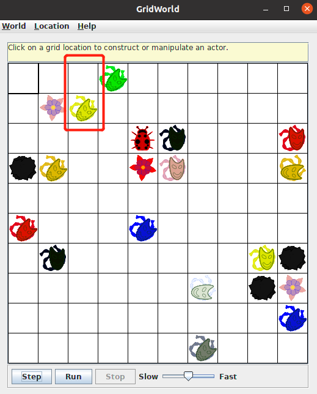
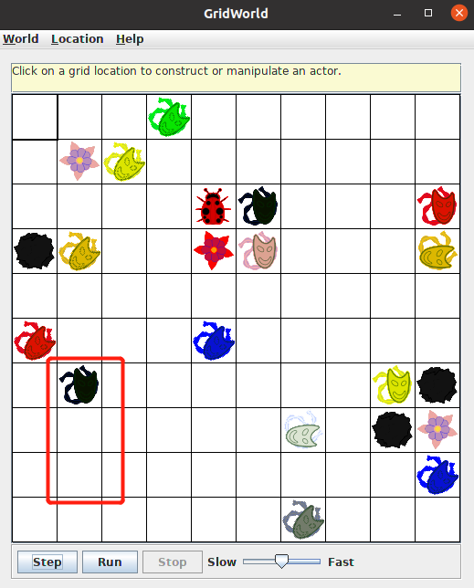

# Part3

## 文件夹结构

```
.
|-- Jumper.java
|-- JumperRunner.java
|-- JumperTest.java
|-- lib
    |-- gridworld.jar
|-- build.xml
|-- sonar-project.properties
|-- Image
|-- README.md
```

## 项目运行

### JumperRunner.java文件

在`build.xml`文件目录下，终端输入命令：

    ant

运行程序，截图如下：


### 使用junit进行测试

在`build.xml`文件目录下，终端输入命令：

    ant junit

程序进行junit测试，截图如下：


可以看到，所有测试全部通过

### Sonar测试

如果要使用Sonar进行分析，首先在终端输入`cd %SONAR_HOME%`进入SonarQube的`bin`文件夹目录下，然后输入`./sonar.sh start`启动Sonar服务，等到在浏览器输入网址 http://localhost:9000/ ，看到SonarQube的服务页面后，进入`Part3`项目文件夹，输入`sonar-scanner`，即可进行分析。登录进去之后，点击`Part3`项目，可以看到分析结果如下：


项目没有严重或阻断问题，只有几个异味，且来源都是因为没有把文件放在包里所引起的，这些异味可以忽略，符合代码分析要求。


项目的重复行为0，注释率为18.8%，大于10%，符合要求。

### 行为测试

#### 跳跃动作表

|情况|跳跃动作|
|----|-------|
|如果jumper前面的位置是空的，但前面两个单元格的位置，包含一朵花或一块石头|jumper会调用turn方法向右转45°|
|如果jumper前面的两个单元格的位置超出grid|jumper会调用turn方法向右转45°|
|如果jumper面对grid的边缘|jumper会调用turn方法向右转45°|
|如果另一个actor（非花或者石头）在jumper前面两个单元格的单元格里|jumper会调用turn方法向右转45°|
|当jumper碰到另一个jumper在其路径上时，如果jumper前面两个单位格，为网格内的没有actor（包括石头或花）或另一个jumper的单元格|jumper会跳到那个单元格|
|当jumper碰到另一个jumper在其路径上时，如果jumper前面两个单元格，为网格外或单元格内有actor（包括石头或花）或另一个jumper|jumper会调用turn方法向右转45°|
|当jumper前面一个单元格中有一个actor（包括石头或花）时，如果jumper前面两个单位格，为网格内的没有actor（包括石头或花）或另一个jumper的单元格|jumper会跳到那个单元格|
|当jumper前面一个单元格中有一个actor（包括石头或花）时，如果jumper前面两个单元格，为网格外或单元格内有actor（包括石头或花）或另一个jumper|jumper会调用turn方法向右转45°|

#### 跳跃动作测试

**1、如果jumper前面的位置是空的，但前面两个单元格的位置，包含一朵花或一块石头，jumper会调用turn方法向右转45°**

在`JumperTest.java`文件中编写相应的测试代码：

```java
@Test
public void test1() {
    ActorWorld world = new ActorWorld();
    
    Jumper jumper1 = new Jumper(Color.RED);
    world.add(new Location(5, 0), jumper1);
    world.add(new Location(3, 0), new Rock());

    world.step();

    assertEquals(new Location(5, 0), jumper1.getLocation());
    assertEquals(Location.NORTHEAST, jumper1.getDirection());
}

@Test
public void test2() {
    ActorWorld world = new ActorWorld();
    
    Jumper jumper2 = new Jumper(Color.ORANGE);
    world.add(new Location(3, 1), jumper2);
    world.add(new Location(1, 1), new Flower());

    world.step();

    assertEquals(new Location(3, 1), jumper2.getLocation());
    assertEquals(Location.NORTHEAST, jumper2.getDirection());
}
```

**代码解释：**

在test1方法中，jumper的位置在(5, 0)，朝向北边，前面的位置是空的，但前面两个单元格的位置，有石头在位置(3, 0)，当jumper移动时，按照规则，jumper应该仍在位置(5, 0)，并向右转45°，朝向东北方向。

在test2方法中，jumper的位置在(3, 1)，朝向北边，前面的位置是空的，但前面两个单元格的位置，有花朵在位置(1, 1)，当jumper移动时，按照规则，jumper应该仍在位置(3, 1)，并向右转45°，朝向东北方向。

在`JumperRunner.java`文件中编写相应的代码：

```java
Jumper jumper1 = new Jumper(Color.RED);
world.add(new Location(5, 0), jumper1);
world.add(new Location(3, 0), new Rock());

Jumper jumper2 = new Jumper(Color.ORANGE);
world.add(new Location(3, 1), jumper2);
world.add(new Location(1, 1), new Flower());
```

程序运行起来之后，可以看到：


如果jumper前面的位置是空的，但前面两个单元格的位置，包含一朵花或一块石头，jumper会调用turn方法向右转45°，实现要求。

**2、如果jumper前面的两个单元格的位置超出grid，jumper会调用turn方法向右转45°**

在`JumperTest.java`文件中编写相应的测试代码：

```java
@Test
public void test3() {
    ActorWorld world = new ActorWorld();
    
    Jumper jumper3 = new Jumper(Color.YELLOW);
    world.add(new Location(1, 2), jumper3);

    world.step();

    assertEquals(new Location(1, 2), jumper3.getLocation());
    assertEquals(Location.NORTHEAST, jumper3.getDirection());
}
```

**代码解释：**

在test3方法中，jumper的位置在(1, 2)，朝向北边，前面的两个单元格的位置超出grid，当jumper移动时，按照规则，jumper应该仍在位置(1, 2)，并向右转45°，朝向东北方向。

在`JumperRunner.java`文件中编写相应的代码：

```java
Jumper jumper3 = new Jumper(Color.YELLOW);
world.add(new Location(1, 2), jumper3);
```

程序运行起来之后，可以看到：



如果jumper前面的两个单元格的位置超出grid，jumper会调用turn方法向右转45°，实现要求。

**3、如果jumper面对grid的边缘，jumper会调用turn方法向右转45°**

在`JumperTest.java`文件中编写相应的测试代码：

```java
@Test
public void test4() {
    ActorWorld world = new ActorWorld();
    
    Jumper jumper4 = new Jumper(Color.GREEN);
    world.add(new Location(0, 3), jumper4);

    world.step();

    assertEquals(new Location(0, 3), jumper4.getLocation());
    assertEquals(Location.NORTHEAST, jumper4.getDirection());
}
```

**代码解释：**

在test4方法中，jumper的位置在(0, 3)，朝向北边，面对grid的边缘，当jumper移动时，按照规则，jumper应该仍在位置(0, 3)，并向右转45°，朝向东北方向。

在`JumperRunner.java`文件中编写相应的代码：

```java
Jumper jumper4 = new Jumper(Color.GREEN);
world.add(new Location(0, 3), jumper4);
```

程序运行起来之后，可以看到：


如果jumper面对grid的边缘，jumper会调用turn方法向右转45°，实现要求。

**4、如果另一个actor（非花或者石头）在jumper前面两个单元格的单元格里，jumper会调用turn方法向右转45°**

在`JumperTest.java`文件中编写相应的测试代码：

```java
@Test
public void test5() {
    ActorWorld world = new ActorWorld();
    
    Jumper jumper5 = new Jumper(Color.BLUE);
    world.add(new Location(5, 4), jumper5);
    Bug bug1 = new Bug();
    world.add(new Location(3, 4), bug1);

    world.step();

    assertEquals(new Location(5, 4), jumper5.getLocation());
    assertEquals(Location.NORTHEAST, jumper5.getDirection());
}
```

**代码解释：**

在test5方法中，jumper的位置在(5, 4)，朝向北边，jumper前面两个单位格，还有一个bug(actor)在位置(3, 4)，当jumper移动时，按照规则，jumper应该仍在位置(5, 4)，并向右转45°，朝向东北方向。

在`JumperRunner.java`文件中编写相应的代码：

```java
Jumper jumper5 = new Jumper(Color.BLUE);
world.add(new Location(5, 4), jumper5);
Bug bug1 = new Bug();
world.add(new Location(3, 4), bug1);
```

程序运行起来之后，可以看到：


如果另一个actor（非花或者石头）在jumper前面两个单元格的单元格里，jumper会调用turn方法向右转45°，实现要求。

**5、当jumper碰到另一个jumper在其路径上时，如果jumper前面两个单位格，为网格内的没有actor（包括石头或花）或另一个jumper的单元格，jumper会跳到那个单元格**

在`JumperTest.java`文件中编写相应的测试代码：

```java
@Test
public void test6() {
    ActorWorld world = new ActorWorld();
    
    Jumper jumper6 = new Jumper(Color.PINK);
    world.add(new Location(5, 5), jumper6);
    Jumper jumper7 = new Jumper(Color.BLACK);
    world.add(new Location(4, 5), jumper7);

    world.step();

    assertEquals(new Location(3, 5), jumper6.getLocation());
    assertEquals(Location.NORTH, jumper6.getDirection());
}
```

**代码解释：**

在test6方法中，jumper的位置在(5, 5)，朝向北边，jumper前面一个单位格，还有一个jumper在位置(4, 5)，朝向北边，但是前面两个单位格为空，当jumper移动时，按照规则，jumper应该移动到位置(3, 5)，方向不变，朝向北边。

在`JumperRunner.java`文件中编写相应的代码：

```java
Jumper jumper6 = new Jumper(Color.PINK);
world.add(new Location(5, 5), jumper6);
Jumper jumper7 = new Jumper(Color.BLACK);
world.add(new Location(4, 5), jumper7);
```

程序运行起来之后，可以看到：


当jumper碰到另一个jumper在其路径上时，如果jumper前面两个单位格，为网格内的没有actor（包括石头或花）或另一个jumper的单元格，jumper会跳到那个单元格，实现要求。

**6、当jumper碰到另一个jumper在其路径上时，如果jumper前面两个单元格，为网格外或单元格内有actor（包括石头或花）或另一个jumper，jumper会调用turn方法向右转45°**

在`JumperTest.java`文件中编写相应的测试代码：

```java
@Test
public void test7() {
    ActorWorld world = new ActorWorld();
    
    Jumper jumper8 = new Jumper(Color.GRAY);
    world.add(new Location(9, 6), jumper8);
    Jumper jumper9 = new Jumper(Color.WHITE);
    jumper9.setDirection(Location.EAST);
    world.add(new Location(7, 4), jumper9);

    world.step();

    assertEquals(new Location(9, 6), jumper8.getLocation());
    assertEquals(Location.NORTHEAST, jumper8.getDirection());
}
```

**代码解释：**

在test7方法中，jumper的位置在(9, 6)，朝向北边，还有一个jumper在位置(7, 4)，朝向东边，另一个jumper移动时会移动到jumper的路径上，且在其前面两个单元格位置，所以当jumper移动时，按照规则，jumper应该仍在位置(9, 6)，并向右转45°，朝向东北方向。

在`JumperRunner.java`文件中编写相应的代码：

```java
Jumper jumper8 = new Jumper(Color.GRAY);
world.add(new Location(9, 6), jumper8);
Jumper jumper9 = new Jumper(Color.WHITE);
jumper9.setDirection(Location.EAST);
world.add(new Location(7, 4), jumper9);
```

程序运行起来之后，可以看到：


当jumper碰到另一个jumper在其路径上时，如果jumper前面两个单元格，为网格外或单元格内有actor（包括石头或花）或另一个jumper，jumper会调用turn方法向右转45°，实现要求。

**7、当jumper前面一个单元格中有一个actor（包括石头或花）时，如果jumper前面两个单位格，为网格内的没有actor（包括石头或花）或另一个jumper的单元格，jumper会跳到那个单元格**

在`JumperTest.java`文件中编写相应的测试代码：

```java
@Test
public void test8() {
    ActorWorld world = new ActorWorld();
    
    Jumper jumper10 = new Jumper(Color.RED);
    world.add(new Location(4, 9), jumper10);
    Jumper jumper11 = new Jumper(Color.ORANGE);
    jumper11.setDirection(Location.EAST);
    world.add(new Location(3, 7), jumper11);

    world.step();

    assertEquals(new Location(2, 9), jumper10.getLocation());
    assertEquals(Location.NORTH, jumper10.getDirection());
}

@Test
public void test9() {
    ActorWorld world = new ActorWorld();
    
    Jumper jumper12 = new Jumper(Color.YELLOW);
    world.add(new Location(8, 8), jumper12);
    world.add(new Location(7, 8), new Rock());

    world.step();

    assertEquals(new Location(6, 8), jumper12.getLocation());
    assertEquals(Location.NORTH, jumper12.getDirection());
}
```

**代码解释：**

在test8方法中，jumper的位置在(4, 9)，朝向北边，还有一个jumper在位置(3, 7)，朝向东边，另一个jumper移动时会移动到jumper的路径上，但不在其前面两个单元格位置，所以当jumper移动时，按照规则，jumper应该移动到位置(2, 9)，方向不变，朝向北边。

在test9方法中，jumper的位置在(8, 8)，朝向北边，jumper前面一个单位格，还有一个石头在位置(7, 8)，所以当jumper移动时，按照规则，jumper应该移动到位置(6, 8)，方向不变，朝向北边。

在`JumperRunner.java`文件中编写相应的代码：

```java
Jumper jumper10 = new Jumper(Color.RED);
world.add(new Location(4, 9), jumper10);
Jumper jumper11 = new Jumper(Color.ORANGE);
jumper11.setDirection(Location.EAST);
world.add(new Location(3, 7), jumper11);

Jumper jumper12 = new Jumper(Color.YELLOW);
world.add(new Location(8, 8), jumper12);
world.add(new Location(7, 8), new Rock());
```

程序运行起来之后，可以看到：


当jumper前面一个单元格中有一个actor（包括石头或花）时，如果jumper前面两个单位格，为网格内的没有actor（包括石头或花）或另一个jumper的单元格，jumper会跳到那个单元格，实现要求。

**8、当jumper前面一个单元格中有一个actor（包括石头或花）时，如果jumper前面两个单元格，为网格外或单元格内有actor（包括石头或花）或另一个jumper，jumper会调用turn方法向右转45°**

在`JumperTest.java`文件中编写相应的测试代码：

```java
@Test
public void test10() {
    ActorWorld world = new ActorWorld();
    
    Jumper jumper13 = new Jumper(Color.BLUE);
    world.add(new Location(8, 9), jumper13);
    world.add(new Location(6, 9), new Rock());
    world.add(new Location(7, 9), new Flower());

    world.step();

    assertEquals(new Location(8, 9), jumper13.getLocation());
    assertEquals(Location.NORTHEAST, jumper13.getDirection());
}
```

**代码解释：**

在test10方法中，jumper的位置在(8, 9)，朝向北边，前面一个和两个单元格，分别有一个花朵和一个石头在位置(6, 9)和位置(7, 9)，所以当jumper移动时，按照规则，jumper应该仍在位置(8, 9)，并向右转45°，朝向东北方向。

在`JumperRunner.java`文件中编写相应的代码：

```java
Jumper jumper10 = new Jumper(Color.RED);
world.add(new Location(4, 9), jumper10);
Jumper jumper11 = new Jumper(Color.ORANGE);
jumper11.setDirection(Location.EAST);
world.add(new Location(3, 7), jumper11);
```

程序运行起来之后，可以看到：


当jumper前面一个单元格中有一个actor（包括石头或花）时，如果jumper前面两个单元格，为网格外或单元格内有actor（包括石头或花）或另一个jumper，jumper会调用turn方法向右转45°，实现要求。

**9、正常进行测试，当jumper前面一个和两个单元格都为空时，jumper会跳到前面两个单元格**

在`JumperTest.java`文件中编写相应的测试代码：

```java
@Test
public void test11() {
    ActorWorld world = new ActorWorld();
    
    Jumper jumper14 = new Jumper(Color.BLACK);
    world.add(new Location(8, 1), jumper14);

    world.step();

    assertEquals(new Location(6, 1), jumper14.getLocation());
    assertEquals(Location.NORTH, jumper14.getDirection());
}
```

**代码解释：**

在test11方法中，jumper的位置在(8, 1)，朝向北边，前面一个和两个单元格都为空，按照规则，jumper应该移动到位置(6, 1)，方向不变，朝向北边。

在`JumperRunner.java`文件中编写相应的代码：

```java
Jumper jumper14 = new Jumper(Color.BLACK);
world.add(new Location(8, 1), jumper14);
```

程序运行起来之后，可以看到：



当jumper前面一个和两个单元格都为空时，jumper会跳到前面两个单元格，实现要求。
