# Part4

## 文件夹结构

```
.
|-- BlusterCritter
    |-- BlusterCritter.java
    |-- BlusterCritterRunner.java
|-- ChameleonKid
    |-- ChameleonKid.java
    |-- ChameleonKidRunner.java
|-- KingCrab
    |-- KingCrab.java
    |-- KingCrabRunner.java
|-- ModifiedChameleonCritter
    |-- ModifiedChameleonCritter.java
    |-- ModifiedChameleonCritterRunner.java
|-- QuickCrab
    |-- QuickCrab.java
    |-- QuickCrabRunner.java
|-- RockHound
    |-- RockHound.java
    |-- RockHoundRunner.java
|-- CrabCritter
    |-- CrabCritter.java
|-- lib
    |-- gridworld.jar
|-- build.xml
|-- sonar-project.properties
|-- Image
|-- README.md
```

## 项目运行

### ModifiedChameleonCritter项目

根据要求，修改 ChameleonCritter 中的 processActors 方法，如果要处理的 actor 列表为空，则 ChameleonCritter 的颜色会变暗。

#### 实现思路

在ChameleonCritter类的processActors方法中，首先使用`int n = actors.size()`得到使用getActors方法获得的可以进行处理actor的个数，如果n=0，即没有actor可以处理，那么直接返回：

```java
if (n == 0)
    return;
```

现在如果要处理的 actor 列表为空，则 ModifiedChameleonCritter 的颜色会变暗，那就在n=0的条件判断语句中，加入使颜色变暗的语句：

```java
if (n == 0) {
    Color c = getColor();
    int red = (int) (c.getRed() * (1 - DARKENING_FACTOR));
    if (red < 0 || red > 255) {
        red /= (1 - DARKENING_FACTOR);
    }
    int green = (int) (c.getGreen() * (1 - DARKENING_FACTOR));
    if (green < 0 || green > 255) {
        green /= (1 - DARKENING_FACTOR);
    }
    int blue = (int) (c.getBlue() * (1 - DARKENING_FACTOR));
    if (blue < 0 || blue > 255) {
        blue /= (1 - DARKENING_FACTOR);
    }

    setColor(new Color(red, green, blue));

    return;
}
```

这样就实现了要处理的actor列表为空时ModifiedChameleonCritter的颜色会变暗的效果。

#### 运行截图

在`build.xml`文件目录下，终端输入命令：

    ant ModifiedChameleonCritter

运行程序，截图如下：

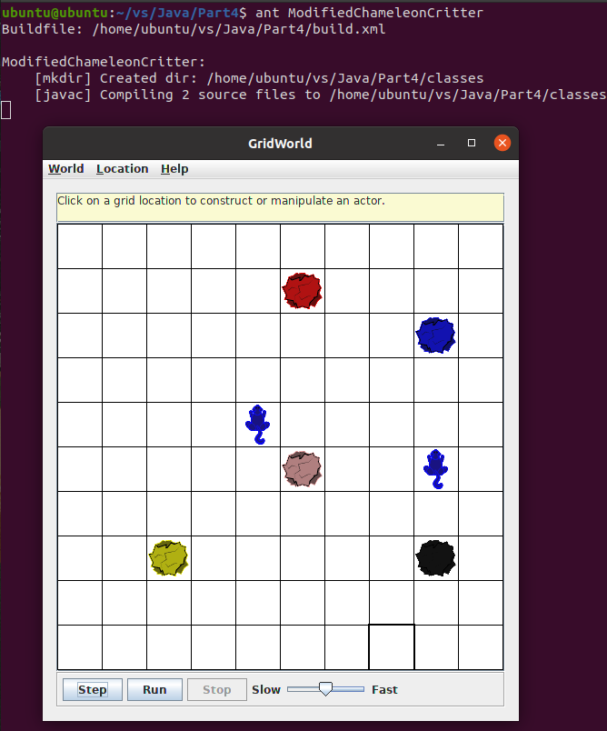

点击`Step`按钮后，可以看到：

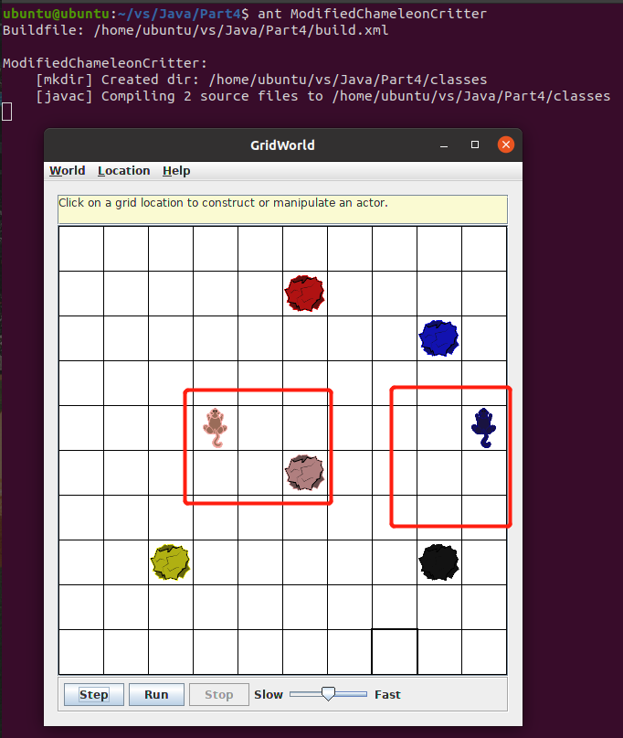

左边的小动物因为周围有粉色的actor(石头)，所以颜色也变成粉色，右边的小动物周围没有actor，所以按照要求变暗。

### ChameleonKid项目

根据要求，ChameleonKid 继承 ModifiedChameleonCritter。ChameleonKid 将其颜色更改为紧邻前面或后面的actor之一的颜色。如果这两个位置都没有actor，则 ChameleonKid 会像 ModifiedChameleonCritter 一样变暗。

#### 实现思路

首先ChameleonKid类继承ModifiedChameleonCritter类，然后因为ChameleonKid只对紧邻其前面或后面的actor进行操作，所以在使用getActors方法时，就可以只返回这两个方位的actor，重写getActors方法：

```java
public ArrayList<Actor> getActors()
{
    ArrayList<Actor> actors = new ArrayList<>();
    int[] dirs =
        { Location.AHEAD, Location.HALF_CIRCLE };
    for (Location loc : getLocationsInDirections(dirs))
    {
        Actor a = getGrid().get(loc);
        if (a != null)
            actors.add(a);
    }

    return actors;
}

public ArrayList<Location> getLocationsInDirections(int[] directions)
{
    ArrayList<Location> locs = new ArrayList<>();
    Grid gr = getGrid();
    Location loc = getLocation();

    for (int d : directions)
    {
        Location neighborLoc = loc.getAdjacentLocation(getDirection() + d);
        if (gr.isValid(neighborLoc))
            locs.add(neighborLoc);
    }
    return locs;
}
```

其中getLocationsInDirections方法直接从CrabCritter中复制过来。

#### 运行截图

在`build.xml`文件目录下，终端输入命令：

    ant ChameleonKid

运行程序，截图如下：

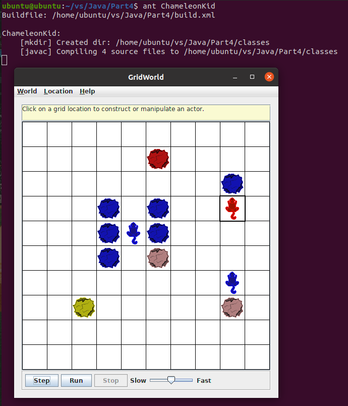

点击`Step`按钮后，可以看到：

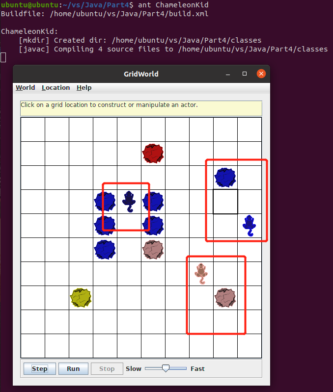

左边的小动物紧邻其前面和后面都没有actor，虽然其它方位都有actor，但是按照要求，这个小动物会变暗。右边的两个小动物一个前面有蓝色的actor(石头)，另一个后面有粉色的actor(石头)，所以它们会分别变成蓝色和粉色。

### RockHound项目

根据要求，RockHound 类继承 Critter。RockHound 以与 Critter 相同的方式处理 actor。它从grid中删除该列表中的所有岩石。RockHound 像小动物一样移动。

#### 实现思路

首先RockHound类继承Critter类，这样也就继承了Critter的移动方式，然后因为RockHound会删除actor列表中所有的石头，所以在使用processActors方法时，就可以进行判断，将是石头的actor给删掉：

```java
public void processActors(ArrayList<Actor> actors)
{
    for (Actor a : actors)
    {
        if (!(a instanceof Critter))
            a.removeSelfFromGrid();
    }
}
```

#### 运行截图

在`build.xml`文件目录下，终端输入命令：

    ant RockHound

运行程序，截图如下：

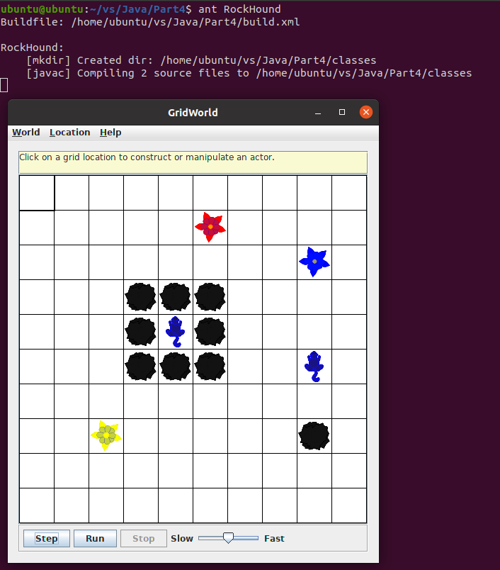

点击`Step`按钮后，可以看到：

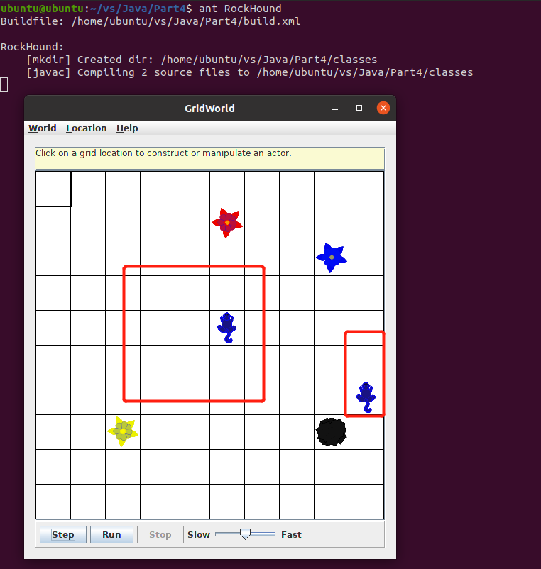

左边的小动物周围全是石头，根据Critter的处理方式，这些石头都在actor列表中，所以按照要求应该全部删除，同时可以看到，左边和右边的小动物继承了Critter的移动方式。

### BlusterCritter项目

根据要求，BlusterCritter 类继承 Critter。BlusterCritter 查看其当前位置两步内的所有邻居。（对于不在边缘附近的 BlusterCritter，这包括 24 个位置）。它计算这些位置的小动物数量。如果少于 c 个小动物，BlusterCritter 的颜色会变亮（颜色值增加）。如果有 c 个或更多小动物，BlusterCritter 的颜色会变暗（颜色值会降低）。这里，c 是表示小动物勇气的值。它应该在构造函数中设置。

#### 实现思路

首先BlusterCritter类继承Critter类，其次定义两个亮度增加值和亮度减少值的静态成员变量，以及定义一个表示勇气值的成员变量：

```java
private static final double LIGHTENING_FACTOR = -0.5;
private static final double DARKENING_FACTOR = 0.5;
private int courageVal;
```

根据要求，要在构造函数中设置勇气值，那么：

```java
public BlusterCritter(int c) {
    courageVal = c;
}
```

然后因为BlusterCritter要查看其当前位置两步内的所有邻居，所以要重写getActors方法：

```java
public ArrayList<Actor> getActors()
{
    ArrayList<Actor> actors = new ArrayList<>();
    Grid gr = getGrid();
    int beginRow = getLocation().getRow() - 2;
    int beginCol = getLocation().getCol() - 2;
    for(int row = beginRow; row <= beginRow + 4; ++row) {
        for(int col = beginCol; col <= beginCol + 4; ++col) {
            Location loc = new Location(row, col);
            if (gr.isValid(loc)) {
                Actor actor = (Actor)gr.get(loc);
                if ((actor instanceof Critter) && actor != this) {
                    actors.add(actor);
                }
            }
        }
    }

    return actors;
}
```

最后要计算actor列表中小动物的数量，根据数量与勇气值的关系使BlusterCritter的颜色变亮或变暗：

```java
public void processActors(ArrayList<Actor> actors)
{
    int actorNum = actors.size();
    if (actorNum < courageVal) {
        changeColor(LIGHTENING_FACTOR);
    }
    else {
        changeColor(DARKENING_FACTOR);
    }
}

private void changeColor(double factor)
{
    Color c = getColor();
    int red = (int) (c.getRed() * (1 - factor));
    if (red < 0 || red > 255) {
        red /= (1 - factor);
    }
    int green = (int) (c.getGreen() * (1 - factor));
    if (green < 0 || green > 255) {
        green /= (1 - factor);
    }
    int blue = (int) (c.getBlue() * (1 - factor));
    if (blue < 0 || blue > 255) {
        blue /= (1 - factor);
    }

    setColor(new Color(red, green, blue));
}
```

#### 运行截图

一开始设置每个BlusterCritter的勇气值都为2，

在`build.xml`文件目录下，终端输入命令：

    ant BlusterCritter

运行程序，截图如下：

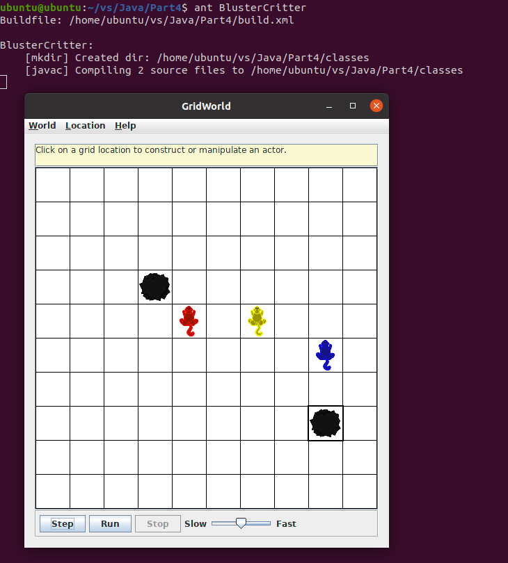

点击`Step`按钮后，可以看到：

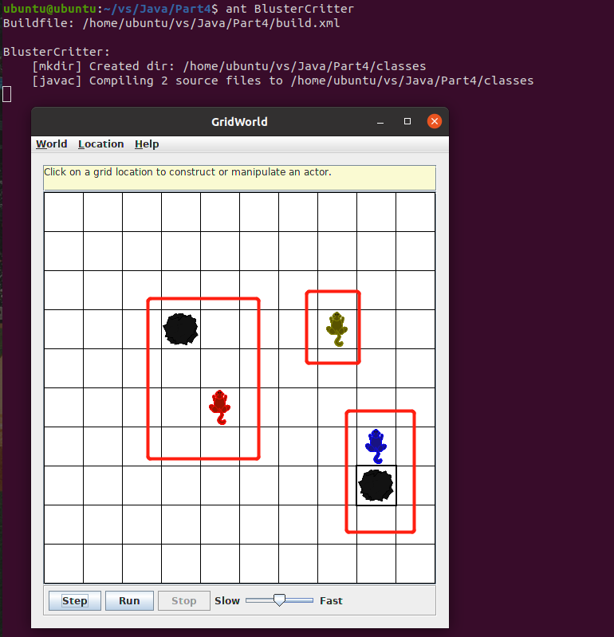

左边的红色小动物和右边的蓝色小动物一开始周围两个单元格内只有黄色小动物和石头，因为石头虽然是actor但是不算小动物，所以c为1，按照要求颜色变亮，中间的黄色小动物一开始周围两个单元格内有红色小动物和蓝色小动物，所以c为2，那么按照要求，颜色变暗。

### QuickCrab项目

根据要求，QuickCrab 类继承 CrabCritter 。QuickCrab 以与 CrabCritter 相同的方式处理 actor。如果一个位置在其右侧或左侧两个单元格的位置，且该位置和中间位置都为空，那么 QuickCrab 会移动到随机选择的左右两个位置之一。否则，QuickCrab 会像 CrabCritter 一样移动。

#### 实现思路

首先QuickCrab类继承CrabCritter类，这样也就继承了不能移动到右侧或左侧两个单元格位置时，CrabCritter的移动方式，然后因为QuickCrab要判断是否可以移动到右侧或左侧两个单元格位置，所以要重写getMoveLocations方法：

```java
public ArrayList<Location> getMoveLocations()
{
    ArrayList<Location> locs = new ArrayList<>();
    int[] dirs =
        { Location.LEFT, Location.RIGHT };
    for (Location loc : getTwoSpacesLocationsInDirections(dirs))
        if (getGrid().get(loc) == null)
            locs.add(loc);
    if (locs.size() > 0) {
        return locs;
    }
    for (Location loc : getLocationsInDirections(dirs))
        if (getGrid().get(loc) == null)
            locs.add(loc);

    return locs;
}

public ArrayList<Location> getTwoSpacesLocationsInDirections(int[] directions)
{
    ArrayList<Location> locs = new ArrayList<>();
    Grid gr = getGrid();
    Location loc = getLocation();

    for (int d : directions)
    {
        Location neighborLoc = loc.getAdjacentLocation(getDirection() + d);
        Location twoLoc = neighborLoc.getAdjacentLocation(getDirection() + d);
        if (gr.isValid(neighborLoc) && gr.isValid(twoLoc) &&
                gr.get(neighborLoc) == null && gr.get(twoLoc) == null) {
            locs.add(twoLoc);
        }
    }
    return locs;
}
```

#### 运行截图

在`build.xml`文件目录下，终端输入命令：

    ant QuickCrab

运行程序，截图如下：

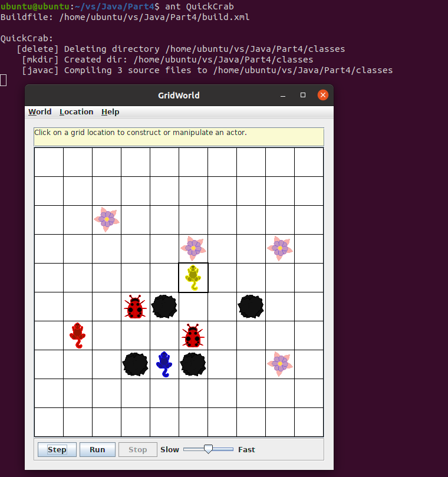

点击`Step`按钮后，可以看到：

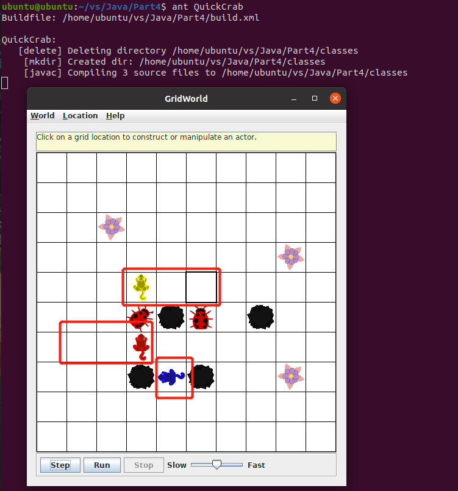

可以看到，最下面的蓝色动物，因为左右两侧都有石头占据，所以不能移动到右侧或左侧两个单元格位置时，像CrabCritter一样移动，随机向左或向右旋转90°。

最左边的红色动物，因为左边两个单元格的位置是grid外，而右边一个和两个单元格的位置都为空，所以选择向右移动两个单元格。

黄色动物因为左右两边都为空，所以随机选择向左或向右移动两个单元格。

### KingCrab项目

根据要求，KingCrab 类继承 CrabCritter 。KingCrab 以与 CrabCritter 相同的方式处理 actor。KingCrab 会导致它处理的每个actor 移动一个位置，使其远离 KingCrab。如果actor无法移开，KingCrab 会将其从网格中移除。当 KingCrab 完成对 actor 的处理后，它会像 CrabCritter 一样移动。

#### 实现思路

首先KingCrab类继承CrabCritter类，这样也就继承了CrabCritter的移动方式，然后因为KingCrab会导致它处理的每个actor移动一个位置，使其远离KingCrab或者移除，所以要重写processActors方法：

```java
public void processActors(ArrayList<Actor> actors)
{
    Grid gr = getGrid();
    Location loc = getLocation();
    for (Actor a : actors) {
        Location actorLoc = a.getLocation();
        int dir;
        for (dir = Location.NORTH; dir <= Location.NORTHWEST; dir += Location.HALF_RIGHT) {
            if (loc.getAdjacentLocation(dir).equals(actorLoc)) {
                break;
            }
        }
        Location nextLoc = a.getLocation().getAdjacentLocation(dir);
        if (gr.isValid(nextLoc)) {
            a.moveTo(nextLoc);
        }
        else {
            a.removeSelfFromGrid();
        }
    }
}
```

#### 运行截图

在`build.xml`文件目录下，终端输入命令：

    ant KingCrab

运行程序，截图如下：

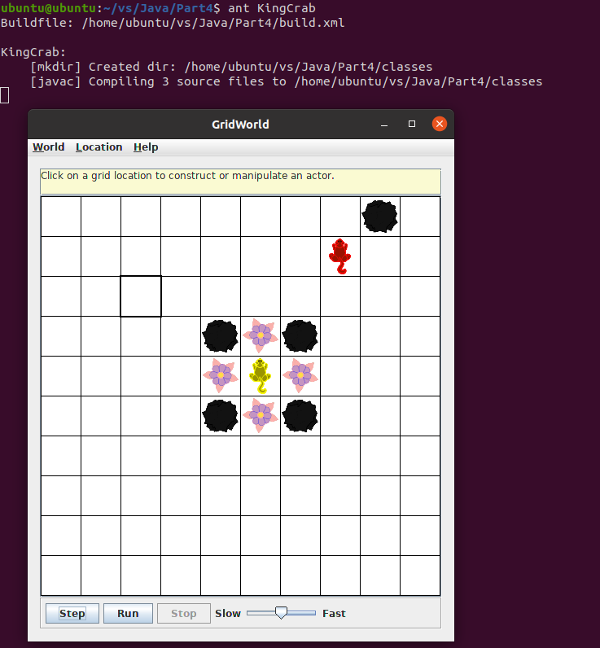

点击`Step`按钮后，可以看到：

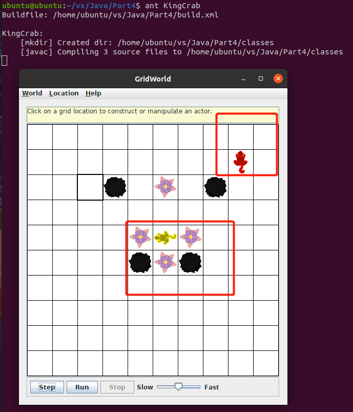

黄色动物周围都是actor(石头或花朵)，因为KingCrab以与CrabCritter相同的方式处理actor，所以只将前方、左前方、右前方的actor推走远离，符合要求。

红色动物右前方为actor(石头)，因为石头靠近grid边缘无法移开，所以直接删除，符合要求。

### Sonar测试

如果要使用Sonar进行分析，首先在终端输入`cd %SONAR_HOME%`进入SonarQube的`bin`文件夹目录下，然后输入`./sonar.sh start`启动Sonar服务，等到在浏览器输入网址 http://localhost:9000/ ，看到SonarQube的服务页面后，进入`Part4`项目文件夹，输入`sonar-scanner`，即可进行分析。登录进去之后，点击`Part4`项目，可以看到分析结果如下：

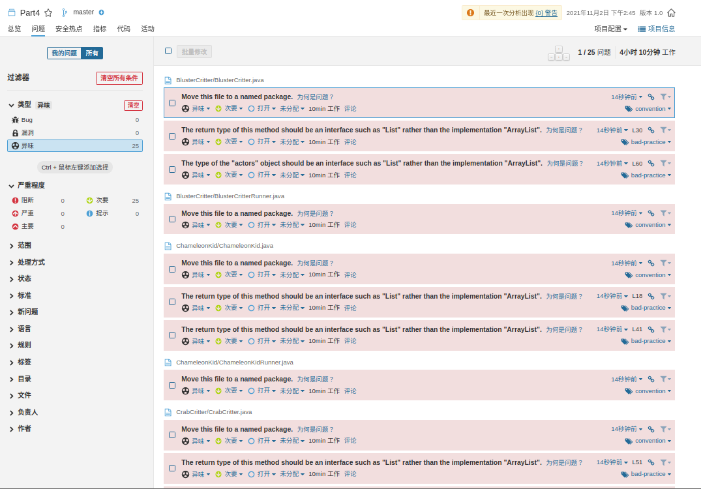

项目没有严重或阻断问题，只有几个异味，且来源都是因为没有把文件放在包里或没有用List类型代替ArrayList作返回类型所引起的，因为重写的是Critter中的返回类型为ArrayList的方法，Critter在jar包中，无法修改，所以这些异味可以忽略，符合代码分析要求。


项目的重复行为0，注释率为17.2%，大于10%，符合要求。
