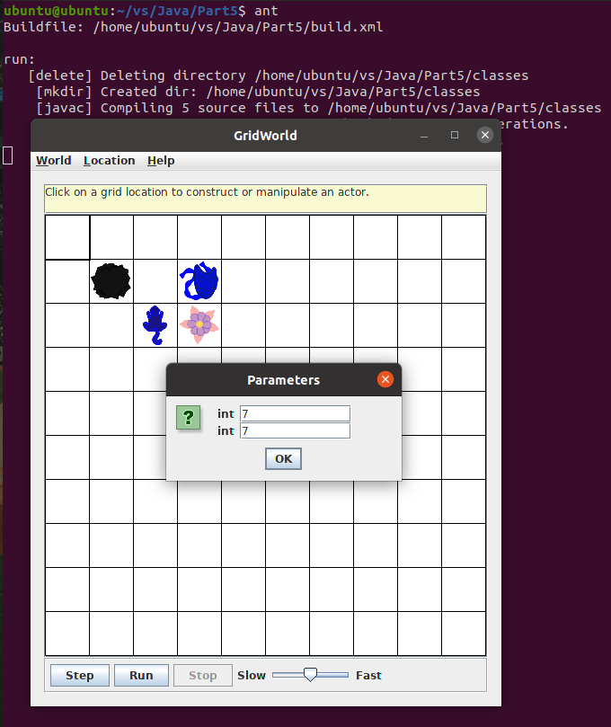

# Part5

## 文件夹结构

```
.
|-- 1
    |-- SparseBoundedGrid.java
    |-- SparseGridNode.java
|-- 2
    |-- SparseBoundedGrid2.java
|-- 3
    |-- UnboundedGrid2.java
|-- SparseGridRunner
    |-- SparseGridRunner.java
|-- lib
    |-- gridworld.jar
|-- build.xml
|-- sonar-project.properties
|-- Image
|-- README.md
```

## 实现思路

**1、使用“稀疏数组”实现的类SparseBoundedGrid：**

首先实现链表结点：

```java
public class SparseGridNode
{
    private Object occupant;
    private int col;
    private SparseGridNode next;
    ... ...
}
```

然后定义存储grid中不为空的位置的成员变量稀疏矩阵，以及这个稀疏矩阵的行数和列数：

```java
private SparseGridNode[] occupantArray; // the array storing the grid elements
private int rowsNum;
private int columnsNum;
```

稀疏矩阵occupantArray中每一个元素存储一个链表的头结点，表示该行元素，如果这一行有单元格被占据，那么就向这一行对应的链表添加结点，存储占据信息。如果r是行数, c是列数, n是被占据的单元格数，那么那么存储空间复杂度就从O(r * c)降到了O(n)。

在getOccupiedLocations方法中，通过遍历每条链表的结点来获取被占据的位置：

```java
// Look at sparse grid locations.
for (int r = 0; r < getNumRows(); r++)
{
    // Put the location in the array.
    SparseGridNode curNode = occupantArray[r];
    while(curNode != null) {
        Location loc = new Location(r, curNode.getCol());
        theLocations.add(loc);
        curNode = curNode.getNext();
    }
}
```

如果r是行数, c是列数, n是被占据的单元格数，这个操作不用像原来一样遍历二维数组，那么时间复杂度就从O(r * c)降到了O(n)。

相应的，get、put、remove方法也要按照链表的方式进行重写，进行操作时时间复杂度为O(n)。

**2、使用HashMap来实现SparseBoundedGrid2：**

首先定义存储grid中不为空的位置的成员变量哈希表，以及这个稀疏矩阵的行数和列数：

```java
private HashMap<Location, E> occupantMap; // the map storing the grid elements
private int rowsNum;
private int columnsNum;
```

因为UnboundedGrid类也使用的是Map来存储grid中不为空的位置，所以其它方法可以借助UnboundedGrid类来实现，getOccupiedLocations可以不加改变地使用，因为实现的是有界grid，所以put、get、remove方法只需要加多一条判定位置是否有效的语句：

```java
if (!isValid(loc))
    throw new IllegalArgumentException("The Location " + loc
            + " isn't valid");
```

**3、通过可增大的数组实现UnboundedGrid2：**

首先定义存储grid中位置的成员变量二维数组，以及这个二维数组当前维数：

```java
private Object[][] occupantArray; // the array storing the grid elements
private int dimension;
```

构造函数分配一个 16 x 16 的数组：

```java
public UnboundedGrid2()
{
    dimension = 16;
    occupantArray = new Object[dimension][dimension];
}
```

因为是无界grif，所以getNumRows()和getNumCols()方法都要返回-1，而isValid方法只需要保证行值和列值是非负数：

```java
public boolean isValid(Location loc)
{
    return loc.getCol() >= 0 && loc.getRow() >= 0;
}
```

getOccupiedLocations()方法可以直接参考BoundedGrid，只需要把行数和列数换成dimension就行。

get方法和remove方法也与BoundedGrid大致相同，只需要在判定位置的行值或列值大于当前维数时，返回null即可。

在put方法中，实现也与BoundedGrid大致相同，如果放入的位置的行值或列值大于当前维数时，需要增大数组，使用doubleSize方法实现：

```java
public void doubleSize(int row, int col) {
    int newDimension = dimension;
    while (newDimension <= row || newDimension <= col) {
        newDimension *= 2;
    }
    Object[][] newArray = new Object[newDimension][newDimension];
    for(int i = 0; i < dimension; ++i) {
        for(int j = 0; j < dimension; ++j) {
            newArray[i][j] = occupantArray[i][j];
            if (j == dimension - 1) {
                break;
            }
        }
    }
    occupantArray = newArray;
    dimension = newDimension;
}
```

将原来的数组的维数增大为两倍，这样就模拟了无界grid，通过使用二维数组。

## 项目运行

在`build.xml`文件目录下，终端输入命令：

    ant

运行程序，截图如下：


可以看到，有SparseBoundedGrid、SparseBoundedGrid2、UnboundedGrid2新增的三种Grid可供选择。

点击SparseBoundedGrid或SparseBoundedGrid2，会要求输入行数和列数，输入完后会生成新的Grid：




可以看到，正常的put、get、remove方法都可以进行，比如在左下角放多一个Critter，获取Critter的颜色为蓝色，把石头移除掉：


如果点击UnboundedGrid2，会变成无界grid：


可以看到，正常的put、get、remove方法都可以进行，比如在右下角放多一个Critter，获取花朵的颜色为粉色，把石头移除掉：


## Sonar测试

如果要使用Sonar进行分析，首先在终端输入`cd %SONAR_HOME%`进入SonarQube的`bin`文件夹目录下，然后输入`./sonar.sh start`启动Sonar服务，等到在浏览器输入网址 http://localhost:9000/ ，看到SonarQube的服务页面后，进入`Part5`项目文件夹，输入`sonar-scanner`，即可进行分析。登录进去之后，点击`Part5`项目，可以看到分析结果如下：


项目没有严重或阻断问题，只有几个异味，且来源都是因为没有把文件放在包里或没有用List类型代替ArrayList作返回类型所引起的，因为重写的是AbstractGrid中的返回类型为ArrayList的方法，AbstractGrid在jar包中，无法修改，所以这些异味可以忽略，符合代码分析要求。


项目的重复行为0，注释率为12.4%，大于10%，符合要求。
